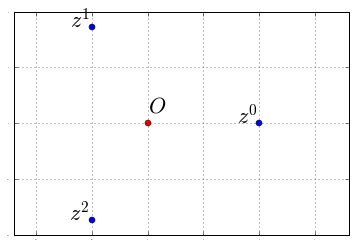
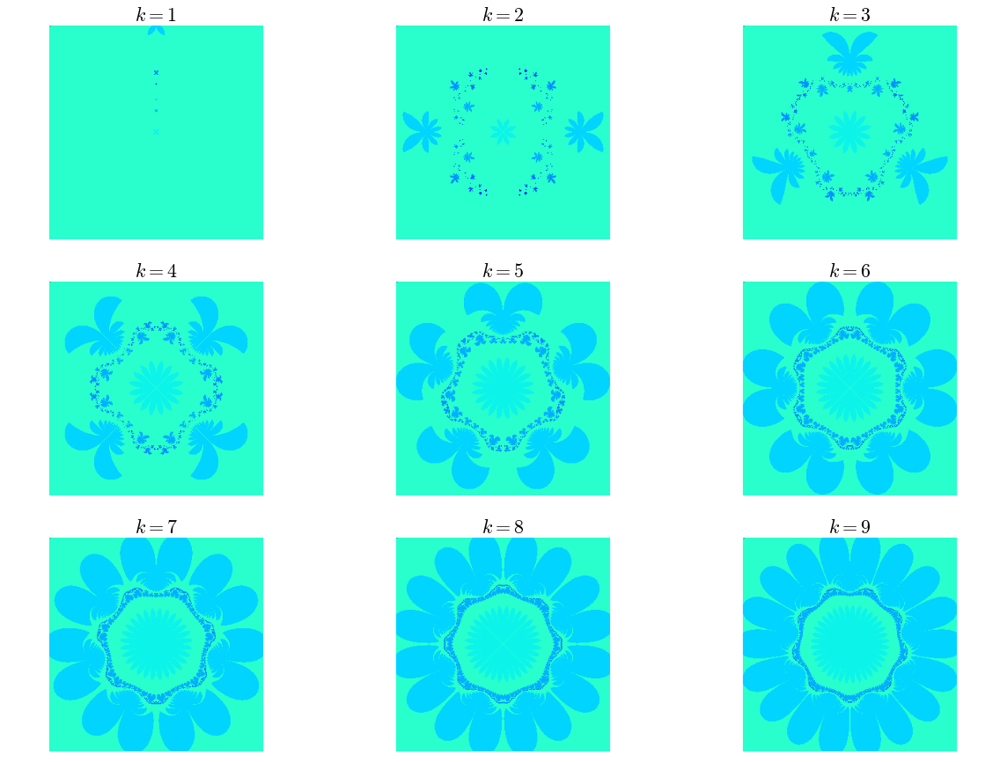

Biomorphes III : des symétries d'ordre :math:`k`
================================================

Dans le `billet précédent <link://slug/biomorphes-ii-bestiaire>`_, j'ai colorié un domaine du plan complexe en
partant de la fonction :math:`p` suivante :

.. math::  p(z) = \dfrac{1}{z^3} +\dfrac{1}{2}

Ce qui a donné la très belle image suivante :

.. image:: ../../images/Biomorphes3/biomorphes3-1.png
  :align: center
.. raw:: html

   <!--TEASER_END -->

On peut observer une symétrie sur le dessin : si vous faites tourner la
figure autour de son centre d'un tiers de tour (c'est-à-dire : si vous
faites une rotation d'angle :math:`\frac{2\pi}{3}`), vous retrouvez la
même figure. On dit que la figure présente une *symétrie d'ordre 3*.

Pourquoi cette symétrie ? Pour expliquer cela, un petit rappel sur les
complexes : si vous avez un nombre complexe de module 1, mettons

.. math:: z = e ^{i \theta}

une application de la formule de Moivre donne :

.. math:: z^3=e^{3i\theta}

Donc si on choisit :math:`\theta = 2\pi/3`, les points d'affixe
:math:`z,z^2,z^3=1` se répartissent sur les sommets d'un triangle
équilatéral puisqu'ils se déduisent les uns des autres par
multiplication par :math:`z` qui code la rotation de centre :math:`O` et
d'angle :math:`\dfrac{2\pi}{3}` :

.. code:: python

    title_font = { 'size':'22', 'color':'black'}
    
    z  = exp(2j*pi/3)
    
    X = [ (z**k).real for  k in range(3)]
    Y = [ (z**k).imag for  k in range(3)]
    
    matplotlib.rcParams.update({'font.size': 1})
    for k in range(3):
        plt.text(X[k]-0.2,Y[k], r'$z^{}$'.format(k),**title_font)
    plt.text(0,+0.1, r'$O$',**title_font)
    plt.plot(X,Y,'o')
    plt.plot(0,0,'ro')
    plt.axis('equal')
    plt.grid('on')

On voit très bien qu'il y a une symétrie d'ordre 3, puisque si vous
faites des tiers de tour autour du point rouge, l'ensemble des points
bleus (situés sur les sommets d'un triangle équilatéral) n'a pas bougé.

Ainsi, dans la fonction :math:`p` n'a plus grand chose d'une bestiole,
la présence de l'exposant :math:`-3` dans l'expression de :math:`p(z)`
induit une symétrie d'ordre 3.

Et si on regardait en introduisant une symétrie d'ordre :math:`k, k \ge 1` ? C'est-à-dire en essayant avec la fonction

.. math::  z\mapsto p_k(z) = z^{-k} + \dfrac{1}{2} 

.. code:: python

    # nombre de points dans le domaine
    
    nx = 300
    ny = 300
    
    
                               
    fig =plt.figure(figsize=(20,20))     ;    # je dimensionne le dessin
    k=1
    
    
    for k in range (1,10):
        (xmin,xmax,ymin,ymax) = domaine
        ax = fig.add_subplot(430+k)    # je crée un sous-graphique
        plt.title(r'$k={}$'.format(k),**title_font)           # je lui mets un titre  
        plt.axis('equal')               # repère orthonormé
        coloriage(k, xmin, xmax, ymin, ymax, nx,ny,ax)

Vous voyez se dessiner à l'interface avec les "pétales" une espèce de
dentelle qui évoque un polygone à :math:`k` côtés (pour :math:`k=5`,
on voit très  bien le pentagone). Ça ferait des jolis sweats non ?
