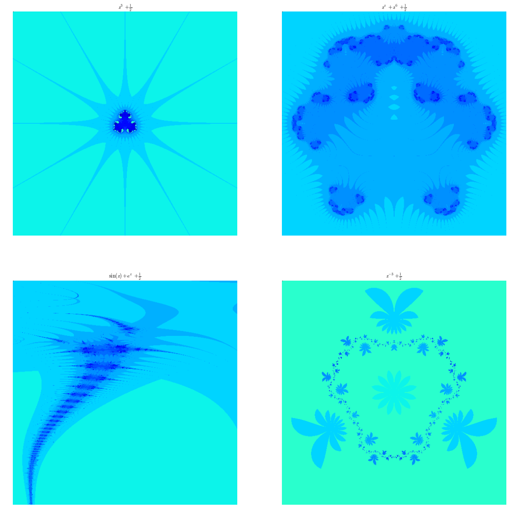

.. title: Biomorphes II : bestiaire 
.. slug: biomorphes-ii-bestiaire
.. date: 2016-01-24 22:36:59 UTC+01:00
.. tags: subplot, images, biomorphes
.. link: 
.. description: 
.. type: text
.. category: images

.. class:: alert alert-info pull-right

.. contents::

C'est la suite du `billet  <link:///blog/posts/Biomorphes/>`_ dans lequel j'avais promis des images.

J'avais déjà écrit un billet du même genre `ici  <link:///blog/posts/photos-de-vacances/>`_. Mais, contrairement à ce
que j'avais fait dans le billet sur l'ensemble de Mandelbrot, je vais
générer la gallerie d'images en **Python**, ce qui vous permettra de
vous familiariser avec la commande **subplot**.

.. raw:: html

      <!-- TEASER_END -->

Pour rappel : je prends des points régulièrement répartis dans la région
du plan complexe définie par :

.. math::  D = \{ x+ iy \quad x\in  [\texttt{Xmin}, \texttt{Xmax}] \quad y \in [\texttt{Ymin};\texttt{Ymax}]\} 

Je considère pour chacun de ces points la suite :math:`(u_n)` définie
par :math:`u_{n+1} = F(u_n) ` et de premier terme :math:`u_0` égal au
point considéré. Suivant la fonction :math:`F` que l'on choisit, on
obtient des dessins assez variables, et assez fascinants :

.. math::

    \begin{array}{cc|c|c|c}    
    \textrm{Bestiole}   & \textrm{(fonction)} &\texttt{Xmin} & \texttt{Xmax} &  \texttt{Ymin} & \texttt{Ymax} \\ \hline
   f(z) =  & z^3 +\dfrac{1}{2}              & -10  & 10  & -10  & 10   \\
           &                                & -2   & 2   &  -2  &  2   \\
   g(z) =  &  z^z + z^6 + \dfrac{1}{2}      & -1.2 & 1.2 & -1.2 & 1.2  \\
   h(z) =  & \sin(z) + e^{z} + \dfrac{1}{2} & 0.5  & 6   & 1.7  & 3.3 \\
   p(z) =  & z^{-3} + \dfrac{1}{2}          & -2   & 2   & -2   & 2
   \end{array}

.. raw:: html

   <!--TEASER_END -->

Importation des modules
-----------------------

.. code:: python

    import numpy as np
    import matplotlib.pyplot as plt
    import matplotlib.image as mpimg
    
    # Dans Spyder, remplacez la  commande  qui suit par : plt.ion() mais,
    # elle est inutile  pour ceux qui  ont une console interactive 
    # (c-à-d prompt qui ressemble à In [1]:  et pas à  >>> )
    
    %matplotlib inline

Les différentes bestioles et leur habitat
-----------------------------------------

Je crée les bestioles et les domaines de points
:math:`\texttt{[Xmin,Xmax,Ymin,Ymax]}` associés à chaque bestiole
(domaine : zone du plan complexe où se cache la bête) :

.. code:: python

    def f(z):
        return z**3+0.5
        
    def g(z):
        return z**z+z**6+ 0.5
        
    def h(z):
        return np.sin(z)+np.exp(z)+0.5
    
    def p(z):
        return z**(-3)+0.5

Comme j'ai en vue l'automatisation de la création des images, je vais
consigner toutes mes fonctions dans une liste, puisque les listes sont
itérables :

.. code:: python

    fonctions = [f,g,h,p]

De même, je crée les domaines relatifs à chaque fonction puis la liste
de ces domaines :

.. code:: python

    dom_f = [-10,10,-10,10]
    dom_g = [-1.2,1.2,-1.2,1.2]
    dom_h = [0.5, 6, 1.7, 3.3]
    dom_p = [-2,2,-2,2]
    
    domaines = [dom_f, dom_g, dom_h, dom_p]

Je crée enfin la liste des tuples (fonction,domaine) :

.. code:: python

    bestioles = [ (fonctions[i], domaines[i]) for i in range(4)]
    bestioles # pour que vous voyiez la structure de la liste

.. parsed-literal::

    [(<function __main__.f>, [-10, 10, -10, 10]),
     (<function __main__.g>, [-1.2, 1.2, -1.2, 1.2]),
     (<function __main__.h>, [0.5, 6, 1.7, 3.3]),
     (<function __main__.p>, [-2, 2, -2, 2])]

Et tant qu'à faire, la liste des noms des fonctions pour légender mes
graphiques :

.. code:: python

    noms=[r'$z^3 + \frac{1}{2}$', r'$z^z+z^6+\frac{1}{2}$', r'$\sin(z) + e^z + \frac{1}{2}$', r'$z^{-3}+\frac{1}{2}$']

Fonction de calcul de la durée de vie
-------------------------------------

Ce qui est formidable, c'est que même les fonctions peuvent être prises
comme variables d'entrée des fonctions :

.. code:: python

    def dureeDeVie(f,u):
        """ u : un complexe
            f : une fonction
            retourne le plus petit rang n inférieur ou égal à 10 pour
            lequel la partie réelle et la partie imaginaire excèdent 10 
            strictement en valeur absolue pour la suite récurrente de premier
            terme u et associée à la fonction f.
            Si cet entier n'existe pas, on le pose égal à 0.
        """
        z = u # on peut faire les deux d'un coup : z,k = u,0 
        k = 0
        while k<= 10 and (abs(z.imag)<=10 or abs(z.real)<=10):
            z=f(z)
            k+=1
        if k==11:
            return 0
        else:
            return k       

Fonction de coloriage
---------------------

.. code:: python

    def  coloriage(f, xmin, xmax, ymin, ymax, nx,ny,ax):
        """ je n'explique pas pour le moment ... """
        
        X = np.linspace(xmin,xmax,nx)  # je crée les subdivisons le long des X
        Y = np.linspace(ymax,ymin,ny)  # idem le long des Y
        A = np.zeros((ny,nx))          # J'initialise un tableau de taille ny x nx
        for i in range(0,ny):
            for j in range(0,nx):
                A[i,j]= dureeDeVie(f,X[i]+1j*Y[j]) # je place en position [i,j] du tableau la durée de vie du germe
        
        A=12-A                                   # Comme je veux colorier dans des teintes de bleu, je fais des 
        A[0,0]=0                                 # petites transformations sur les coefficients de A 
        A[1,1]=30
        ax.axis('off')
        ax.imshow(A)
        

Génération de la gallerie
-------------------------
        
Il n'y a plus qu'à faire la boucle sur les bestioles :

.. code:: python

    # nombre de points dans le domaine
    
    nx = 500
    ny = 500
    
    
                               
    fig = plt.figure(figsize=(20,20))     ;    # je dimensionne le dessin
    k=1
    
    for bestiole  in bestioles: # je prends les bestioles une par une
        fonction = bestiole[0]
        (xmin,xmax,ymin,ymax) = bestiole[1]
        ax = fig.add_subplot(220+k)    # je crée un sous-graphique
        plt.title(noms[k-1])           # je lui mets un titre  
        plt.axis('equal')               # repère orthonormé
        coloriage(fonction, xmin, xmax, ymin, ymax, nx,ny,ax)
        k+=1

