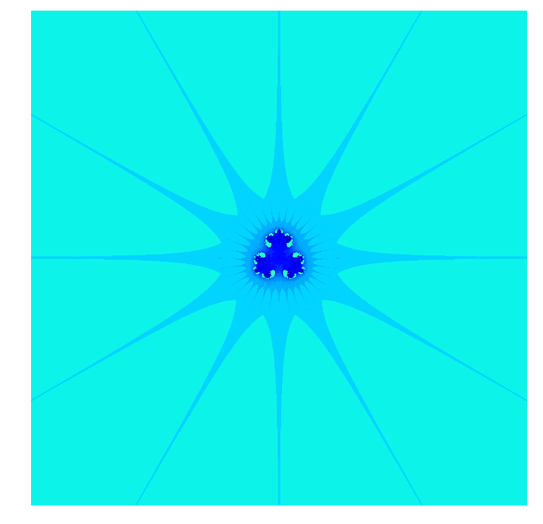

.. title: Des biomorphes dans le plan complexe
.. slug: biomorphes
.. date: 2015-12-8 13:39:19 UTC+02:00
.. tags: python, complexes
.. category: informatique
.. link: 
.. description: 
.. type: text

Les biomorphes de Pickover
==========================

    *Sometimes I consider myself as a fisherman. Computer programs and
    ideas are my hooks, rods and reels. Computer pictures are the
    trophies and delicious meals.*

Dans les années 80, par une erreur de programmation, Clifford Pickover,
ingénieur chez IBM, a découvert accidentellement d'étranges organismes
habitant le plan complexe.

.. raw:: html

   <!--TEASER_END -->

J'avais déjà écrit un billet du même genre `ici <link:///blog/posts/eq2deg/>`_.

..  class:: alert alert-info pull-right

.. contents::

Une fonction
------------

Je pars de la fonction suivante :

.. math:: f  : z \mapsto z^3 + \dfrac{1}{2}

.. code:: python

    def f(z):
        return z**3+0.5

La suite associée
-----------------

Puis je considère la suite à termes *complexes* définie par :

.. math::   u_0 \in \mathbf{C} \quad \text{et}  \quad \forall n \in \mathbf{N} \quad u_{n+1} = f(u_n).

Du vocabulaire
--------------

J'introduis une terminologie un peu plus imagée :

1. Le nombre :math:`u_0` s'appelle le *germe* de la suite.

2. La suite :math:`(u_n)` obtenue avec ce :math:`u_0` s'appelle *chemin
   de germe* :math:`u_0`.

3. Chaque terme de la suite s'appelle une *étape* du chemin de germe
   :math:`u_0`.

Je crée une petite fonction qui m'affiche à l'écran les étapes
:math:`u_0,\dots,u_{10}` du chemin de germe ``u``. Notez que cette que
la fonction ne fait que des affichages à l'écran : ce qui veut dire
qu'elle ne contient aucun ``return``.

.. code:: python

    def affiche_etapes(u):
        """ affiche les 10 premières étapes du chemin de germe u """
        z = u
        print z
        for k in range(0,10):
            z = f(z)
            print z

Des germes qui s'épanouissent différemment
------------------------------------------

Regardons mainteant à quoi ressemblent ces étapes pour les germes

``u =``\ :math:`\dfrac{1+i}{10}`, puis ``v =``
:math:`\dfrac{1}{10} + i`.

.. code:: python

    u = 0.1+0.1j  
    v = 0.1+1j
    
    
    affiche_etapes(u)

.. parsed-literal::

    (0.1+0.1j)
    (0.498+0.002j)
    (0.623500016+0.001488016j)
    (0.74238290489+0.00173540549842j)
    (0.909144548014+0.00286930924827j)
    (1.25142534303+0.00711480576453j)
    (2.45962387367+0.0334263930208j)
    (15.3718639571+0.606626575308j)
    (3615.81197535+429.803790659j)
    (45269612832.1+16778490159.2j)
    (5.4540134647e+31+9.8430942148e+31j)

On constate que même avec un germe petit en module, la suite diverge
très vite : la partie imaginaire de :math:`u_{10}` est de l'ordre de
:math:`10^{32}` !

.. code:: python

    affiche_etapes(v)

.. parsed-literal::

    (0.1+1j)
    (0.201-0.97j)
    (-0.059242099+0.79510609j)
    (0.612149526656-0.494289480722j)
    (0.280704025372-0.434905067102j)
    (0.362838889673-0.0205457121985j)
    (0.54730899572-0.00810598311135j)
    (0.663836956576-0.00728383947623j)
    (0.792433683119-0.00962912988368j)
    (0.997389212694-0.0181389765106j)
    (1.49120357853-0.0541271902603j)

Pour ce germe, la dynamique est très différente : les termes restent
plutôt petits.

Germe tranquille ou explosif
----------------------------

Encore un peu de vocabulaire en lien avec les comportements précédemment observés :

Considérons un germe :math:`u_0`.

1. Si on a

   .. math::  \forall k\in\{0,\dots,10\} \left|\mathfrak{Re}\left(u_k\right)\right| \le 10 \quad \textbf{ ou } \quad  \left|\mathfrak{Im}\left(u_k\right)\right| \le 10

   on dira que le germe :math:`u_0` est *tranquille*.

2. Sinon, on dira que le germe :math:`u_0` est *explosif*. Dans ce cas, le
   plus petit rang :math:`k\in\{0,\dots 10\}` pour lequel

.. math:: \left|\mathfrak{Re}\left(u_k\right)\right| > 10 \quad \textbf{ et } \quad \left|\mathfrak{Im}\left(u_k\right)\right| >  10

s'appelle la *durée de vie* du germe :math:`u_0`.

Par exemple, avec les calculs et notations précédents , le germe ``u``
est explosif et sa e durée de vie est ``8``, tandis que le germe ``v``
est tranquille.

Calculons des durées de vie
---------------------------

Je crée une fonction ``dureeDeVie(u)`` qui prend en entrée un nombre
complexe ``u`` qui détermine si le germe ``u`` est tranquille ou
explosif et retourne en sortie : ``0`` si le germe est tranquille, sinon
il retourne sa durée de vie.

Pour cela :

1. Je constate que je dois calculer au plus les dix premiers termes de
   la suite. Comme je ne sais pas combien de termes j'aurai à calculer,
   je programme une boucle **while** (je pourrais programmer une boucle
   **for** avec interruption de la boucle, mais on verra cela plus
   tard).

2. Je vais commencer par formaliser la condition de *sortie de boucle* :
   je sors de la boucle quand :math:`k>10` ou quand
   :math:`\left|\mathfrak{Re}\left(u_k\right)\right| > 10 \quad \textbf{ et } \quad \left|\mathfrak{Im}\left(u_k\right)\right| >  10`.

3. La conditon de boucle est donc la négation de cette dernière, ce qui
   me donne la fonction suivante :

.. code:: python

    def dureeDeVie(u):
        """ retourne le plus petit rang n inférieur ou égal à 10 pour
            lequel la partie réelle et la partie imaginaire excèdent 10 
            strictement en valeur absolue.
            Si cet entier n'existe pas, on le pose égal à 0.
        """
        z = u # on peut faire les deux d'un coup : z,k = u,0 
        k = 0
        while k<= 10 and (abs(z.imag)<=10 or abs(z.real)<=10):
            z=f(z)
            k+=1
        if k==11:
            return 0
        else:
            return k       

Je vérifie que ma fonction me donne bien pour les germes ``u`` et ``v``
précédents les valeurs que j'avais observé, à savoir : ``8`` et ``0``
respectivement :

.. code:: python

    dureeDeVie(u),dureeDeVie(v)

.. parsed-literal::

    (8, 0)

Un petit dessin vaut mieux que bla bla ...
------------------------------------------

Je calcule par exemple la durée de vie des germes $ $ pour
:math:`k = 1,..,10`

.. code:: python

    for k in range(1,11):
            print 'germe : ' , 0.1*(1+ 1j*k), '. Durée de vie : ', dureeDeVie(0.1*(1+ 1j*k))

.. parsed-literal::

    germe :  (0.1+0.1j) . Durée de vie :  8
    germe :  (0.1+0.2j) . Durée de vie :  8
    germe :  (0.1+0.3j) . Durée de vie :  8
    germe :  (0.1+0.4j) . Durée de vie :  8
    germe :  (0.1+0.5j) . Durée de vie :  8
    germe :  (0.1+0.6j) . Durée de vie :  9
    germe :  (0.1+0.7j) . Durée de vie :  9
    germe :  (0.1+0.8j) . Durée de vie :  10
    germe :  (0.1+0.9j) . Durée de vie :  10
    germe :  (0.1+1j) . Durée de vie :  0

Je viens de calculer la durée de vie de 10 germes. Et si je les
représentais dans le plan complexe et les coloriais en fonction de leur
durée de vie ? J'obtiens le dessin suivant :

.. image:: ../../images/Biomorphes/ReseauProtozozo.jpg
   :height: 350px
   :align: center

Mais Python peut le faire
-------------------------

Importation des modules
~~~~~~~~~~~~~~~~~~~~~~~

.. code:: python

    import numpy as np
    import matplotlib.pyplot as plt
    
    # Dans Spyder, remplacez la  commande  qui suit par : plt.ion() mais,
    #elle inutile je pense pour ceux qui  ont une console interactive 
    # (c-à-d prompt qui ressemble à In [1]: et pas  >>> )
    
    %matplotlib inline

Je vais faire faire le coloriage par Python :

.. code:: python

    A = np.array([[0,10,9,9,8,8,8,8,8]]).T # je crée ma colonne de points avec leur durée de vie.
    plt.figure(figsize=(3,3))              # je redimensionne le dessin
    plt.axis('off')                       # cache les axes
    plt.imshow(A,vmin=-3, vmax=15)        # Je dessine

.. image::  ../../images/Biomorphes/output_24_1.png

C'est quand même plus propre que mon dessin à la main, mais je ne vais pas m'arrêter en si bon
chemin.

Il peut en faire plus
~~~~~~~~~~~~~~~~~~~~~

Je vais fabriquer une fonction qui prend en entrée :

1. Un domaine rectangulaire du plan complexe représenté par une liste
   ``(xmin, xmax, xmin,ymax)``.

2. Le nombre de subdivisions ``nx`` le long du segment ``[xmin, xmax]``

3. Le nombre de subdivisions ``ny`` le long du segment ``[ymin, ymax]``

Et qui génère :

1. Le tableau ``A``  contenant les durées de vie de tous les points de
   ce réseau, comme je l'avais fait à la main juste avant.
2. L'affichage du coloriage correspondant

.. code:: python

    def coloriage( xmin, xmax, ymin, ymax, nx,ny ):
        X = np.linspace(xmin,xmax,nx)  # je crée les subdivisons le long des X
        Y = np.linspace(ymax,ymin,ny)  # idem le long des Y
        A = np.zeros((ny,nx))          # J'initialise un tableau de taille ny x nx
        for i in range(0,ny):
            for j in range(0,nx):
                A[i,j]= dureeDeVie(X[i]+1j*Y[j]) # je place en position [i,j] du tableau la durée de vie du germe
        
        A=12-A                                   # Comme je veux colorier dans des teintes de bleu, je fais des 
        A[0,0]=0                                 # petites transformations sur les coefficients de A 
        A[1,1]=30
        plt.figure(figsize=(10,10))
        plt.axis('off')
        plt.imshow(A)
        
        

Enfin des images
----------------

Voici ce que cela donne si on prend des germes dont la partie réelle est
entre ``xmin= -10`` et ``xmax= 10``. De même pour la partie imaginaire
: ``ymin = - 10``, et ``ymax =10``. Je vais prendre des subdivisions de
``nx = ny = 1000`` points, ce qui fait que mon réseau contient
:math:`1000 \times 1000 =` 1 million de germes. Bien que mon programme
ne soit pas du tout optimisé pour calculer rapidement, ce calcul de 1
million de durées de vie est assez court (quelques secondes). Voici ce
que cela donne :

.. code:: python

    xmin = -10
    xmax = 10
    ymin = -10
    ymax = 10
    nx = 1000
    ny =1000
    
    coloriage(xmin,xmax, ymin,ymax,nx,ny)

On obtient une sorte de radiolaire à 12 branches. Je peux zoomer dans le
coeur du radiolaire :

.. code:: python

    coloriage(-2,2,-2,2,1000,1000)

.. image:: ../../images/Biomorphes/output_30_0.png

Dans un autre `billet  <link:///blog/posts/biomorphes-ii-bestiaire/>`_,  je vous montrerai d'autres biomorphes.

