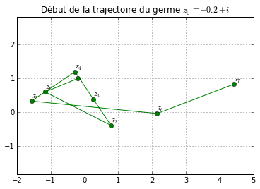

.. title: L'équation du second degré en vacances
.. slug: eq2deg
.. date: 2015-10-18 13:39:19 UTC+02:00
.. tags: suites, fractales, mandelbrot
.. category: 
.. link: 
.. description: 
.. type: text

.. class:: alert alert-info pull-right

.. contents::

Ce qui est vraiment fascinant avec les maths, c'est que quand on croit
qu'on a fait le tour d'une question, on peut toujours lui trouver une
face par laquelle on ne l'a pas regardée. Et ça peut donner des points
de vue incroyables. Je vais prendre un exemple qui peut paraître blasant
: l'équation du second degré.

.. raw:: html

   <!-- TEASER_END -->

Dans le cours on a vu les formules permettant de résoudre l'équation du
second degré à coefficients réels. Et on a généré grâce aux nombres
complexes des solutions non réelles (c'est le principal intérêt des
nombres complexes, et la raison historique de leur apparition).

Des germes et des trajectoires
------------------------------

Je vais partir d'un nombre complexe quelconque : mettons
:math:`z_0 \in \mathbf C.` Et je vais considérer la suite suivante
:math:`(z_n),` dont le premier terme, est, vous vous en doutez,
:math:`z_0`, et dont les termes suivants se calculent de proche en
proche par la formule de récurrence suivante :

.. math::  \forall n\in \mathbf{N} \quad z_{n+1} = z_n^2 + z_0. 

Vous voyez, la fonction cachée derrière cette suite est le prototype de
la fonction trinôme : la fonction

.. math:: f : x\mapsto x^2 +z_0

(c'est juste une parabole translatée d'un facteur complexe, mais si
:math:`z_0` est réel, on retrouve une translation comme vue dans le
billet ....).

Je commence par définir la fonction :math:`f` :

.. code:: python

    def f(z,z0):
        return z**2 + z0 

Un premier exemple
==================

Par exemple, voici la liste des termes de la suite jusqu'à
:math:`z_{15}` en partant de :math:`z_0 = 1+i`.

Puisque la programmation des suites récurrentes n'a plus de secret pour
vous, je peux calculer par la boucle suivante mes termes consécutifs :

.. code:: python

    z0 = 1 + 1j
    N = 16
    z=0
    for n in range(0,N):
        z = f(z,z0)
        print 'rang',n, ":",z

.. parsed-literal::

    rang 0 : (1+1j)
    rang 1 : (1+3j)
    rang 2 : (-7+7j)
    rang 3 : (1-97j)
    rang 4 : (-9407-193j)
    rang 5 : (88454401+3631103j)
    rang 6 : (7.81099614727e+15+6.42374081669e+14j)
    rang 7 : (6.05990163519e+31+1.0035162954e+31j)
    rang 8 : (3.5715362873e+63+1.21624200789e+63j)
    rang 9 : (1.12766268298e+127+8.68770493066e+126j)
    rang 10 : (5.16860956956e+253+1.9593601302e+254j)
    rang 11 : (nan+nanj)
    rang 12 : (nan+nanj)
    rang 13 : (nan+nanj)
    rang 14 : (nan+nanj)
    rang 15 : (nan+nanj)

Voilà qu'apparaissent des **nan** dans les termes de la suite. Ce n'est
pas que **Python** vous dit : "nan, je veux pas calculer". En fait, vous
pouvez remarquer le terme :math:`z_n` devient vite très grand, et pour
**Python**, un nombre trop grand (qui dépasse sa capacité de calcule)
est **nan** : **n**\ ot **a** **n**\ umber.

Un peu de vocabulaire : pour cette suite, le premier terme :math:`z_0`
s'appelle le *germe* de la suite des termes consécutifs s'appelle la
*trajectoire* ou l'\ *orbite* de :math:`z_0`.

Un deuxième exemple
===================

Voici la trajectoire du germe :math:`z_0=i` :

.. code:: python

    z0 =  1j
    N = 16
    z=0
    for n in range(0,N):
        z = f(z,z0)
        print 'rang',n, ":",z

.. parsed-literal::

    rang 0 : 1j
    rang 1 : (-1+1j)
    rang 2 : -1j
    rang 3 : (-1+1j)
    rang 4 : -1j
    rang 5 : (-1+1j)
    rang 6 : -1j
    rang 7 : (-1+1j)
    rang 8 : -1j
    rang 9 : (-1+1j)
    rang 10 : -1j
    rang 11 : (-1+1j)
    rang 12 : -1j
    rang 13 : (-1+1j)
    rang 14 : -1j
    rang 15 : (-1+1j)

On constate qu'elle boucle : on a une orbite périodique. ## Un dernier
exemple Je vais dessiner (le début de) l'orbite d'un :math:`z_0` tel que
ce soit visible sur le dessin. Je pars de :math:`z_0`, et dans ma
boucle, je stocke les coordonnées du terme calculé de la suite pour
enfin relier les points.

.. code:: python

    %matplotlib inline
    import matplotlib.pyplot as plt
    import matplotlib.path as mpath
    import matplotlib.pyplot as plt

.. code:: python

    fig, ax = plt.subplots() # je crée la fenêtre graphique
    Path = mpath.Path        # j'initialise ma trajectoire
    z0 = -0.2+1j             # c'est mon germe
    N = 8                    # Pas trop de points
    z=z0
    path_data=[(Path.MOVETO,(z0.real,z0.imag))] # point de départ
    
    for n in range(1,N): 
        z = f(z,z0)    # calcul du point courant sur la ligne
        plt.text(z.real,z.imag+0.1,r'$z_{'+str(n)+'}$') # légende
        path_data = path_data+[(Path.LINETO,(z.real,z.imag))] # coordonnées
    
    # Un peu de cosmétique

    codes, verts = zip(*path_data);
    path = mpath.Path(verts, codes);
    x, y = zip(*path.vertices);
    line, = ax.plot(x, y, 'go-');
    plt.title(u'Début de la trajectoire du germe '+r'$z_0=-0.2+i$')
    ax.grid();
    ax.axis('equal');

Quel âge a ce germe ?
---------------------

Ces trois exemples ont montré des situations variées.

1. Les termes de la suite s'éloignent indéfiniment de l'origine (ex :
   :math:`z_0=1+i` ou le germe que je viens de dessiner).

2. L'orbite boucle (exemple : :math:`z_0=i`) :

3. (Cas contenant le cas précédent) l'orbite reste dans une région
   bornée : l'orbite est confinée.

En fait on peut montrer qu'il ne se passe que deux choses :

1. Soit un des termes de la suite :math:`(z_n)` dépasse en module
   :math:`2` : dans ce cas l'orbite s'éloigne indéfiniment de l'origine.
   Le permier rang à partir duquel un terme :math:`z_k` de la suite
   vérifie :math:`|z_k|>2` l'âge ou la durée de vie du germe
   :math:`z_0`. Par exemple, le germe :math:`z_0` a pour durée de vie
   :math:`1` puisque pour cette suite, :math:`|z_1| =\sqrt{5}>2` et
   :math:`|z_0|\le 2`.

2. Soit on est dans le cas contraire du cas 1, et la suite reste bornée.
   Dans ce cas on dit le germe est éternel. Le germe :math:`i` est
   éternel.

Colorions les germes de même âge 
================================

Déterminer l'âge d'un germe par le calcul est difficile, mais **Python**
est mon ami. Alors je me suis amusé à calculer l'âge d'un tas de points
du plan complexe et :

1. À colorier d'une même couleur tous les germes de même âge.

2. À colorier en noir les germes éternels. Évidemment, je ne peux pas
   vérifier par le calcul qu'un germe est éternel, mais je pose le
   critère arbitraire suivant : si au bout de 256 termes, aucun terme ne
   vérifie :math:`|z_k|>2`, j'ai de fortes raisons de penser que le
   germe est éternel. Au pire, je mets de l'ombre sur des points qui
   devraient être coloriés.

Vous avez dit fractales ?
==========================

Eh bien figurez-vous qu'en jouant à colorier les germes, cela donne une très belle mosaïque, aussi
complexe (ah ! ah !) que poétique. Regardez (je commente le programme) :

.. code:: python

    import numpy as np

.. code:: python

    x_min =  -1.5  # je vais regarder les germes dans la région -1.5 < Re(z) < 1.5
    x_max = 1.5    # et  idem pour la partie imaginaire. Ça me donne un domaine carré
    y_min = -1.5
    y_max = 1.5
    
    resolution = 1000        # je maille mon domaie en subdivisant en 1000 X 1000 
                             # j'ai donc 1 million de germes
    
    nombre_Iterations = 256  # je regarde mon orbite sur les 256 premiers termes
    
    X = np.linspace(x_min,x_max,resolution).reshape(1,resolution)      # ce qui suit est là pour rendre
    Y = -np.linspace(-y_max,-y_min,resolution).reshape(resolution,1)   # mon calcul plus rapide
    
    U = np.ones((resolution,1))
    
    Re = np.dot(U,X)
    Im = np.dot(Y,U.T)
    Z0 =  Re + 1j*Im
    
    def f(Z,C):
        W = Z**2+C      
        return W
        

.. code:: python

    C = Z0.reshape(resolution**2,) 
    C = Z0    
    Z = np.zeros(np.shape(C))
    A = Z                         # A est la future image
    
    for k in range(0,nombre_Iterations): 
        Z = f(Z,C)
        I,J = np.where(abs(Z) >2) # je cherche les germes de durée de vie k
        Z[I,J] = np.nan           # je les oublie pour la suite
        A[I,J] = k                # dans ma grille je les colorie en k
        
   

.. code:: python

        
    A=A.reshape(resolution,resolution);
    plt.imshow(A,cmap='spectral');
    plt.colorbar();

.. image:: ../../images/Eq2deg/output_14_0.png

Le bel ensemble noir qui se distingue est dans son halo de lumière est
l'\ *ensemble de Mandelbrot*. C'est un ensemble fractal : il est
auto-similaire, c'est-à-dire qu'à toute échelle, vous retrouvez dans
l'ensemble des répliques de l'ensemble lui-même. Je vous montrerai des
photos dans un autre billet.

.. bidon

    x_centre =  -.87591
    y_centre = .20464
    delta = .53184/2
    
    x_min = x_centre - delta
    x_max = x_centre + delta
    y_min = y_centre - delta
    y_max = y_centre + delta

