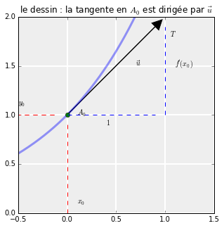

.. title: Géométrie d'une EDL1
.. slug: euler1
.. date: 2015-11-24 13:39:19 UTC+02:00
.. tags: équations différentielles, champ de vecteurs
.. category: 
.. link: 
.. description: 
.. type: text

.. class:: alert alert-info pull-right

.. contents::

Une image pour commencer
------------------------

Je vais partir de l'image suivante : imagine, Biwane, que tu es un grain
de pollen qui se laisse mouvoir au gré des vents. Pour t'aider, je te
mets dans le contexte : tu voles au dessus des côtes californiennes.

.. raw:: html

   <!-- TEASER_END -->

.. code:: python

    from __future__ import division
    from mpl_toolkits.basemap import Basemap
    from osgeo import gdal
    %matplotlib inline
    import matplotlib.pyplot as plt
    import numpy as np
    
    plt.figure(figsize=(15,6))
    map = Basemap(llcrnrlon=-93.7, llcrnrlat=28., urcrnrlon=-66.1, urcrnrlat=39.5,
                  projection='lcc', lat_1=30., lat_2=60., lat_0=34.83158, lon_0=-98.)
    
    ds = gdal.Open("../sample_files/wrf.tiff")
    lons = ds.GetRasterBand(4).ReadAsArray()
    lats = ds.GetRasterBand(5).ReadAsArray()
    u10 = ds.GetRasterBand(1).ReadAsArray()
    v10 = ds.GetRasterBand(2).ReadAsArray()
    speed = np.sqrt(u10*u10 + v10*v10)
    
    x, y = map(lons, lats)
    
    yy = np.arange(0, y.shape[0], 4)
    xx = np.arange(0, x.shape[1], 4)
    
    points = np.meshgrid(yy, xx)
    
    map.drawmapboundary(fill_color='aqua')
    map.fillcontinents(color='#cc9955', lake_color='aqua', zorder = 0)
    map.drawcoastlines(color = '0.15')
    
    map.quiver(x[points], y[points], 
        u10[points], v10[points], speed[points],
        cmap=plt.cm.autumn)
    plt.show()

.. image:: ../../images/Euler/ output_2_0.png
   :scale: 200 %
   :align: center	  

Si tu t'imagines en un point de cette carte, je suis certain que tu vas
réussir à deviner l'allure de ta trajectoire.

Une EDL1, c'est du vent
-----------------------

Eh bien, Biwane,  figure-toi qu'une équation différentielle linéaire d'ordre 1 à
coefficients constants peut se comprendre exactement de la même façon.
En s'appuyant sur une intuition géométrique, on peut deviner l'allure
des solutions  partant d'une condition initiale donnée (ou d'un
point de départ si tu veux, un peu comme toi quand tu étais un grain de
pollen).

Pour illustrer concrètement ceci, je vais, dans toute la suite, prendre
l'exemple de l'équation différentielle suivante :

.. math::  v'+ \dfrac{1}{2}v = 2 \quad \text{ sur} \quad \mathbf R

L'inconnue est la fonction :math:`v`. Je te l'accorde, on ne voit pas
trop où sont les flèches du dessin précédent.

Trois résultats de maths à savoir avant
---------------------------------------

Pour débusquer ces flèches, voici mes trois résultats à avoir en tête :

1. **(R1)** Le premier est le suivant : si une fonction :math:`f` est
   dérivable en un point :math:`x_0` de son domaine, alors : la courbe
   de représentatvie :math:`C_f` de :math:`f` admet au point
   :math:`(x_0,f(x_0))` une tangente :math:`T`.

2. **(R2)** L'équation de cette tangente :math:`T` est :

   .. math:: y = f'(x_0)(x-x_0) +f(x_0)

3. **(R3)** Un vecteur directeur de cette tangente est le vecteur
   :math:`\vec{u}(1,f'(x_0))`. Voir le dessin

4. **(R4)** Sur un petit intervalle partant de :math:`x_0`, la courbe
   :math:`C_f` est quasiment confondue avec :math:`(T)`.

**Remarque.** Je sais, ça fait quatre résultats, mais dans la vie il y a
trois types de gens : ceux qui savent compter et les autres.

Mais arrêtons de blaguer et illustrons ces résultats sur un dessin :

.. code:: python

    from scipy import exp
    fig, ax = plt.subplots(figsize=(5, 5),
                               subplot_kw={'axisbg':'#EEEEEE',
                                           'axisbelow':True});
    ax.grid(color='w', linewidth=2, linestyle='solid');
    x = np.linspace(-0.5, 1.5, 1000)
    L=np.arange(-1,0,0.1)
    C=np.arange(0,1,0.1)
    L1=np.arange(0,1,0.1)
    C1=np.arange(1,2,0.1)
    ax.plot(x, exp(x),lw=3, alpha=0.4)
    ax.set_xlim(-0.5, 1.5)
    ax.set_ylim(0, 2)
    plt.title(r'le dessin : la tangente en $A_0$ est'+u' dirigée'+r' par $\vec{u}$')
    plt.arrow(0,1,0.9,0.9,head_width=0.1, head_length=0.1, fc='black', ec='black')
    plt.text(0.1,0.1,r'$x_0$')
    plt.text(-0.5,1.1,r'$y_0$')
    plt.text(0.1,1,r'$A_0$')
    plt.plot(0,1,'o') 
    plt.plot(L, np.ones(L.shape),'r--')
    plt.plot(L1, np.ones(L1.shape),'b--')
    plt.plot(np.zeros(L.shape),C,'r--')
    plt.text(0.7,1.5,r'$\vec{u}$')
    plt.plot(L, np.ones(L.shape),'r--')
    plt.plot(np.ones(C1.shape),C1,'b--')
    plt.text(0.4,0.9,r'$1$')
    plt.text(1.1,1.5,r"$f'(x_0)$")
    plt.text(1.05,1.8,r"$T$")

	    
Ça y est, on commence à voir des flèches.

Mais revenons à l'équation différentielle
-----------------------------------------

Il s'agit toujours de : :math:`v'+ \dfrac{1}{2}v = 2.` Avec les
notations du cours,  :math:`a=1/2` et  :math:`b=2`.

.. code:: python

    a,b = 0.5,2

D'après le cours, les solutions de l'équation :math:`(E)`   sont
données par la formule dans laquelle $k$ est un réel quelconque :

.. math:: v(t) =\frac{b}{a} +  ke^{-at}= 4 + ke^{-t/2} 

Il y a donc une infinité de solutions.

Si on ajoute la condition initiale en :math:`t=0` par exemple :
$v(0)=v_0$, on obtient la solution unique donnée par :

.. math::  v(t)=4+\left(v_0-4\right)e^{-t/2}

Je trace quelques unes de ces solutions en faisant varier la condition
initiale :math:`v_0` entre 0 et 8 par exemple :

.. code:: python

    t0=0
    tmin, tmax = 0,10 # je trace les solutions sur l'intervalle [0,10]
    vmin, vmax = 0,8
    t=np.linspace(tmin,tmax,50) # 50 points regulierement espacés dans [0,10]

.. code:: python

    fig, ax = plt.subplots(figsize=(15, 6),
                               subplot_kw={'axisbg':'#EEEEEE',
                                           'axisbelow':True});
    ax.grid(color='w', linewidth=2, linestyle='solid');
    
    plt.axis([tmin-0.1,tmax+ 0.1,vmin-0.1,vmax+ 0.1])
    
    for v0 in range(0,9): # je fais varier la condition initiale
            v=b/a+ (v0-b/a) * exp(-a*(t-t0)) # je calcule la solution correspondante
            plt.plot(t,v) # je trace la courbe

.. image:: ../../images/Euler/output_11_0.png
   :scale: 200 %
   :align: center

Au milieu d'un champ de flèches
-------------------------------

Maintenant, considérons une solution :math:`v` de :math:`(E)`. Alors en
tout point :math:`t`, on a, par définition de solution de :math:`(E)`  :

.. math::  v'(t)=2-\dfrac{1}{2}t \quad (\star)

Mettons que la courbe de passe par un point de coordonnées
:math:`(\alpha,\beta)`. Ça veut dire que :math:`t=\alpha,`
:math:`v(t)=\beta` (tu me suis Biwane ?)

Or si je regarde la relation :math:`(\star)`, cela signifie que
:math:`v'(t)=2-\dfrac{1}{2}v(t) = 2-\beta/2`. Ainsi, au point :math:`(\alpha,\beta)` dans le plan, la tangente à la solution passant par ce point est dirigée par le vecteur
$\vec u(1, 2-\beta/2). En résumé :

 
 *Si je connaîs un point de la courbe de* :math:`v` *, je sais comment est
 dirigée la tangente à la courbe en ce point d'après (R3). Normalement,
 ça devrait m'aider à tracer cette courbe. Enfin,  au moins sur un petit intervalle,
 puisque la courbe ressemble à sa tangente localement d'après R4 (Tu es
 toujours là Biwane ?).*

Du coup, j'ai imaginé un réseau de points :math:`(\alpha, \beta)`
régulièrement répartis sur le dessin. Et pour chaque point, j'ai tracé
la direction qu'aurait la tangente de la courbe d'une solution passant
par ce point :

.. code:: python

    fig, ax = plt.subplots(figsize=(15, 6),
                               subplot_kw={'axisbg':'#EEEEEE',
                                           'axisbelow':True});
    ax.grid(color='w', linewidth=2, linestyle='solid');
    alpha_step=1
    beta_step=1
    A,B=np.meshgrid(np.arange(tmin,tmax,alpha_step),np.arange(vmin,vmax,beta_step)) # mon réseau de points (alpha, beta)
    
    U=np.ones(A.shape) #les coordonnées des vecteurs tangents
    V=b-a*B
    
    norme=np.sqrt(1+V**2) # comme je veux simplement la direction des tangentes, la longueur
    Unormalized=U/norme  # flèches ne n'importe pas
    Vnormalized=V/norme   # du coup je les redimensionne toutes
    
    
    
    Q=plt.quiver(A,B,Unormalized,Vnormalized,9-B,pivot='right')
    plt.axis([tmin,tmax,vmin,vmax]);
    plt.xlabel(r'$\alpha$')
    plt.ylabel(r'$\beta$')

.. image:: ../../images/Euler/output_16_1.png
   :scale: 200 %
   :align: center

C'est vrai que rien qu'en regardant ces flèches, on a la sensation de
deviner l'allure des courbes solutions qu'on avait dessiné plus haut.
Cet ensemble de flèches dessiné dans le plan s'appelle **le champ de
vecteurs associé à l'EDL** :math:`(E)`. Dans un prochain billet,
j'expliquerai la méthode d'Euler en s'appuyant sur cette approche
géométrique.
