.. title: Faire dans le Matshow, ça plaît aux filles
.. slug: matshow-ca-plait-aux-filles
.. date: 2016-02-03 18:51:45 UTC+01:00
.. tags: matshow, split
.. category: 
.. link: 
.. description: 
.. type: text

.. class:: alert alert-info pull-right

.. contents::

Lors d'une séance de TP, j'ai montré comment représenter graphiquement
une matrice comme un grille de pixels. En effet, une matrice est une
grille de nombres. Si chaque nombre est représenté par une couleur, on
obtient une belle grille de couleurs, c'est-à-dire une mosaïque. Ça a
beaucoup plu aux filles du groupe du TP. Remarque de macho ? Ça tombe bien,
la commande pour faire cela est aussi **matshow**. Regradons :

.. raw:: html

	 <!-- TEASER_END -->

Les prérequis
-------------

je commence par faire une importation du module des commandes graphiques

.. code:: python

    import matplotlib.pyplot as plt

Je passe en mode interactif :

.. code:: python

    %matplotlib inline

**Remarque.** Ceux qui ont une console interactive dans **Spyder** n'ont
rien à faire. Ceux qui ont une console **python** non interactive (ça se
reconnaît par un prompt ressemblant à :math:`>>>`) devront taper dans
leur console :

.. code:: python

    plt.ion() # ion veut dire : interactive on

Je charge le module dédié aux matrices :

.. code:: python

    import numpy as np

Regardons par exemple la matrice :math:`I_4` identité d'ordre 4 :

.. code:: python

    I4 = np.eye(4)
    print I4

.. parsed-literal::

    [[ 1.  0.  0.  0.]
     [ 0.  1.  0.  0.]
     [ 0.  0.  1.  0.]
     [ 0.  0.  0.  1.]]

Rencontre avec Matshow
----------------------

Voici la mosaïque représentant

.. math:: 
 
  I_4 = \begin{pmatrix} 1 & 0 & 0 & 0\\ 0 & 1 & 0 & 0\\ 0 & 0 & 1 & 0\\ 0 & 0 & 0 & 0 \end{pmatrix} 

.. code:: python

    plt.matshow(I4)

.. parsed-literal::

    <matplotlib.image.AxesImage at 0x10994e1d0>

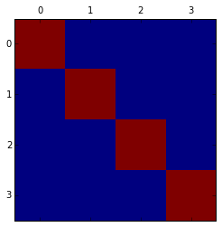

Pourquoi le Matshow plaît aux filles ?
--------------------------------------

Réponse : parce que vous pouvez changer la carte des couleurs. Prenons
une grosse matrice :

.. math::

    M = \begin{pmatrix} 
   1   & 2   & \dots & 100\\
   101 & 102 & \dots & 200 \\
   \vdots &  &  & \vdots \\
   901 &902 & \dots & 1000 
   \end{pmatrix}

Regardons à quoi elle ressemble dans la carte des couleurs standard :

.. code:: python

    M = np.arange(1,1001).reshape(10,100)
    plt.matshow(M)

.. parsed-literal::

    <matplotlib.image.AxesImage at 0x109ba7290>

.. image:: ../../images/Matshow/output_13_1.png

Quelles sont les cartes de couleur ?
~~~~~~~~~~~~~~~~~~~~~~~~~~~~~~~~~~~~

Il y a un tas de cartes disponibles nous dit la doc :

    Spectral, summer, coolwarm, Wistia\_r, pink\_r, Set1, Set2, Set3,
    brg\_r, Dark2, prism, PuOr\_r, afmhot\_r, terrain\_r, PuBuGn\_r,
    RdPu, gist\_ncar\_r, gist\_yarg\_r, Dark2\_r, YlGnBu, RdYlBu,
    hot\_r, gist\_rainbow\_r, gist\_stern, PuBu\_r, cool\_r, cool, gray,
    copper\_r, Greens\_r, GnBu, gist\_ncar, spring\_r, gist\_rainbow,
    gist\_heat\_r, Wistia, OrRd\_r, CMRmap, bone, gist\_stern\_r,
    RdYlGn, Pastel2\_r, spring, terrain, YlOrRd\_r, Set2\_r, winter\_r,
    PuBu, RdGy\_r, spectral, rainbow, flag\_r, jet\_r, RdPu\_r,
    gist\_yarg, BuGn, Paired\_r, hsv\_r, bwr, cubehelix, Greens, PRGn,
    gist\_heat, spectral\_r, Paired, hsv, Oranges\_r, prism\_r, Pastel2,
    Pastel1\_r, Pastel1, gray\_r, jet, Spectral\_r, gnuplot2\_r,
    gist\_earth, YlGnBu\_r, copper, gist\_earth\_r, Set3\_r, OrRd,
    gnuplot\_r, ocean\_r, brg, gnuplot2, PuRd\_r, bone\_r, BuPu,
    Oranges, RdYlGn\_r, PiYG, CMRmap\_r, YlGn, binary\_r, gist\_gray\_r,
    Accent, BuPu\_r, gist\_gray, flag, bwr\_r, RdBu\_r, BrBG, Reds,
    Set1\_r, summer\_r, GnBu\_r, BrBG\_r, Reds\_r, RdGy, PuRd,
    Accent\_r, Blues, autumn\_r, autumn, cubehelix\_r,
    nipy\_spectral\_r, ocean, PRGn\_r, Greys\_r, pink, binary, winter,
    gnuplot, RdYlBu\_r, hot, YlOrBr, coolwarm\_r, rainbow\_r,
    Purples\_r, PiYG\_r, YlGn\_r, Blues\_r, YlOrBr\_r, seismic, Purples,
    seismic\_r, RdBu, Greys, BuGn\_r, YlOrRd, PuOr, PuBuGn,
    nipy\_spectral, afmhot.

Un bon exercice : montrez-nous toutes ces cartes
~~~~~~~~~~~~~~~~~~~~~~~~~~~~~~~~~~~~~~~~~~~~~~~~

Au lieu de  tester ces cartes une par une à la main, je vais demander à
**Python** de le faire. Pour cela, je vais créer la liste contenant le
nom de toutes ces cartes et construire une boucle sur cette liste :

.. code:: python

    cartes = 'Spectral, summer, coolwarm, Wistia_r, pink_r, Set1, Set2, Set3, brg_r, Dark2, prism, PuOr_r, afmhot_r, terrain_r, PuBuGn_r, RdPu, gist_ncar_r, gist_yarg_r, Dark2_r, YlGnBu, RdYlBu, hot_r, gist_rainbow_r, gist_stern, PuBu_r, cool_r, cool, gray, copper_r, Greens_r, GnBu, gist_ncar, spring_r, gist_rainbow, gist_heat_r, Wistia, OrRd_r, CMRmap, bone, gist_stern_r, RdYlGn, Pastel2_r, spring, terrain, YlOrRd_r, Set2_r, winter_r, PuBu, RdGy_r, spectral, rainbow, flag_r, jet_r, RdPu_r, gist_yarg, BuGn, Paired_r, hsv_r, bwr, cubehelix, Greens, PRGn, gist_heat, spectral_r, Paired, hsv, Oranges_r, prism_r, Pastel2, Pastel1_r, Pastel1, gray_r, jet, Spectral_r, gnuplot2_r, gist_earth, YlGnBu_r, copper, gist_earth_r, Set3_r, OrRd, gnuplot_r, ocean_r, brg, gnuplot2, PuRd_r, bone_r, BuPu, Oranges, RdYlGn_r, PiYG, CMRmap_r, YlGn, binary_r, gist_gray_r, Accent, BuPu_r, gist_gray, flag, bwr_r, RdBu_r, BrBG, Reds, Set1_r, summer_r, GnBu_r, BrBG_r, Reds_r, RdGy, PuRd, Accent_r, Blues, autumn_r, autumn, cubehelix_r, nipy_spectral_r, ocean, PRGn_r, Greys_r, pink, binary, winter, gnuplot, RdYlBu_r, hot, YlOrBr, coolwarm_r, rainbow_r, Purples_r, PiYG_r, YlGn_r, Blues_r, YlOrBr_r, seismic, Purples, seismic_r, RdBu, Greys, BuGn_r, YlOrRd, PuOr, PuBuGn, nipy_spectral, afmhot,'

.. code:: python

    print cartes

.. parsed-literal::

    Spectral, summer, coolwarm, Wistia_r, pink_r, Set1, Set2, Set3, brg_r, Dark2, prism, PuOr_r, afmhot_r, terrain_r, PuBuGn_r, RdPu, gist_ncar_r, gist_yarg_r, Dark2_r, YlGnBu, RdYlBu, hot_r, gist_rainbow_r, gist_stern, PuBu_r, cool_r, cool, gray, copper_r, Greens_r, GnBu, gist_ncar, spring_r, gist_rainbow, gist_heat_r, Wistia, OrRd_r, CMRmap, bone, gist_stern_r, RdYlGn, Pastel2_r, spring, terrain, YlOrRd_r, Set2_r, winter_r, PuBu, RdGy_r, spectral, rainbow, flag_r, jet_r, RdPu_r, gist_yarg, BuGn, Paired_r, hsv_r, bwr, cubehelix, Greens, PRGn, gist_heat, spectral_r, Paired, hsv, Oranges_r, prism_r, Pastel2, Pastel1_r, Pastel1, gray_r, jet, Spectral_r, gnuplot2_r, gist_earth, YlGnBu_r, copper, gist_earth_r, Set3_r, OrRd, gnuplot_r, ocean_r, brg, gnuplot2, PuRd_r, bone_r, BuPu, Oranges, RdYlGn_r, PiYG, CMRmap_r, YlGn, binary_r, gist_gray_r, Accent, BuPu_r, gist_gray, flag, bwr_r, RdBu_r, BrBG, Reds, Set1_r, summer_r, GnBu_r, BrBG_r, Reds_r, RdGy, PuRd, Accent_r, Blues, autumn_r, autumn, cubehelix_r, nipy_spectral_r, ocean, PRGn_r, Greys_r, pink, binary, winter, gnuplot, RdYlBu_r, hot, YlOrBr, coolwarm_r, rainbow_r, Purples_r, PiYG_r, YlGn_r, Blues_r, YlOrBr_r, seismic, Purples, seismic_r, RdBu, Greys, BuGn_r, YlOrRd, PuOr, PuBuGn, nipy_spectral, afmhot,

Évidemment, on n'a qu'une chaîne de caractères ici. Je vais séparer
(splitter) les mots de la chaîne :

.. code:: python

    liste1 = cartes.split()

.. code:: python

    print liste1

.. parsed-literal::

    ['Spectral,', 'summer,', 'coolwarm,', 'Wistia_r,', 'pink_r,', 'Set1,', 'Set2,', 'Set3,', 'brg_r,', 'Dark2,', 'prism,', 'PuOr_r,', 'afmhot_r,', 'terrain_r,', 'PuBuGn_r,', 'RdPu,', 'gist_ncar_r,', 'gist_yarg_r,', 'Dark2_r,', 'YlGnBu,', 'RdYlBu,', 'hot_r,', 'gist_rainbow_r,', 'gist_stern,', 'PuBu_r,', 'cool_r,', 'cool,', 'gray,', 'copper_r,', 'Greens_r,', 'GnBu,', 'gist_ncar,', 'spring_r,', 'gist_rainbow,', 'gist_heat_r,', 'Wistia,', 'OrRd_r,', 'CMRmap,', 'bone,', 'gist_stern_r,', 'RdYlGn,', 'Pastel2_r,', 'spring,', 'terrain,', 'YlOrRd_r,', 'Set2_r,', 'winter_r,', 'PuBu,', 'RdGy_r,', 'spectral,', 'rainbow,', 'flag_r,', 'jet_r,', 'RdPu_r,', 'gist_yarg,', 'BuGn,', 'Paired_r,', 'hsv_r,', 'bwr,', 'cubehelix,', 'Greens,', 'PRGn,', 'gist_heat,', 'spectral_r,', 'Paired,', 'hsv,', 'Oranges_r,', 'prism_r,', 'Pastel2,', 'Pastel1_r,', 'Pastel1,', 'gray_r,', 'jet,', 'Spectral_r,', 'gnuplot2_r,', 'gist_earth,', 'YlGnBu_r,', 'copper,', 'gist_earth_r,', 'Set3_r,', 'OrRd,', 'gnuplot_r,', 'ocean_r,', 'brg,', 'gnuplot2,', 'PuRd_r,', 'bone_r,', 'BuPu,', 'Oranges,', 'RdYlGn_r,', 'PiYG,', 'CMRmap_r,', 'YlGn,', 'binary_r,', 'gist_gray_r,', 'Accent,', 'BuPu_r,', 'gist_gray,', 'flag,', 'bwr_r,', 'RdBu_r,', 'BrBG,', 'Reds,', 'Set1_r,', 'summer_r,', 'GnBu_r,', 'BrBG_r,', 'Reds_r,', 'RdGy,', 'PuRd,', 'Accent_r,', 'Blues,', 'autumn_r,', 'autumn,', 'cubehelix_r,', 'nipy_spectral_r,', 'ocean,', 'PRGn_r,', 'Greys_r,', 'pink,', 'binary,', 'winter,', 'gnuplot,', 'RdYlBu_r,', 'hot,', 'YlOrBr,', 'coolwarm_r,', 'rainbow_r,', 'Purples_r,', 'PiYG_r,', 'YlGn_r,', 'Blues_r,', 'YlOrBr_r,', 'seismic,', 'Purples,', 'seismic_r,', 'RdBu,', 'Greys,', 'BuGn_r,', 'YlOrRd,', 'PuOr,', 'PuBuGn,', 'nipy_spectral,', 'afmhot,']

C'est mieux, mais j'ai ces virgules dans les noms des cartes qui me
gênent... Heureusement, les listes en compréhension me sauvent :

.. code:: python

    liste2 = [ mot[:-1] for mot in liste1]
    print liste2

.. parsed-literal::

    ['Spectral', 'summer', 'coolwarm', 'Wistia_r', 'pink_r', 'Set1', 'Set2', 'Set3', 'brg_r', 'Dark2', 'prism', 'PuOr_r', 'afmhot_r', 'terrain_r', 'PuBuGn_r', 'RdPu', 'gist_ncar_r', 'gist_yarg_r', 'Dark2_r', 'YlGnBu', 'RdYlBu', 'hot_r', 'gist_rainbow_r', 'gist_stern', 'PuBu_r', 'cool_r', 'cool', 'gray', 'copper_r', 'Greens_r', 'GnBu', 'gist_ncar', 'spring_r', 'gist_rainbow', 'gist_heat_r', 'Wistia', 'OrRd_r', 'CMRmap', 'bone', 'gist_stern_r', 'RdYlGn', 'Pastel2_r', 'spring', 'terrain', 'YlOrRd_r', 'Set2_r', 'winter_r', 'PuBu', 'RdGy_r', 'spectral', 'rainbow', 'flag_r', 'jet_r', 'RdPu_r', 'gist_yarg', 'BuGn', 'Paired_r', 'hsv_r', 'bwr', 'cubehelix', 'Greens', 'PRGn', 'gist_heat', 'spectral_r', 'Paired', 'hsv', 'Oranges_r', 'prism_r', 'Pastel2', 'Pastel1_r', 'Pastel1', 'gray_r', 'jet', 'Spectral_r', 'gnuplot2_r', 'gist_earth', 'YlGnBu_r', 'copper', 'gist_earth_r', 'Set3_r', 'OrRd', 'gnuplot_r', 'ocean_r', 'brg', 'gnuplot2', 'PuRd_r', 'bone_r', 'BuPu', 'Oranges', 'RdYlGn_r', 'PiYG', 'CMRmap_r', 'YlGn', 'binary_r', 'gist_gray_r', 'Accent', 'BuPu_r', 'gist_gray', 'flag', 'bwr_r', 'RdBu_r', 'BrBG', 'Reds', 'Set1_r', 'summer_r', 'GnBu_r', 'BrBG_r', 'Reds_r', 'RdGy', 'PuRd', 'Accent_r', 'Blues', 'autumn_r', 'autumn', 'cubehelix_r', 'nipy_spectral_r', 'ocean', 'PRGn_r', 'Greys_r', 'pink', 'binary', 'winter', 'gnuplot', 'RdYlBu_r', 'hot', 'YlOrBr', 'coolwarm_r', 'rainbow_r', 'Purples_r', 'PiYG_r', 'YlGn_r', 'Blues_r', 'YlOrBr_r', 'seismic', 'Purples', 'seismic_r', 'RdBu', 'Greys', 'BuGn_r', 'YlOrRd', 'PuOr', 'PuBuGn', 'nipy_spectral', 'afmhot']

Super ! Au fait, ça fait combien de cartes de couleurs ?

.. code:: python

    len(liste2)

.. parsed-literal::

    144

144 cartes.

Regardons enfin les cartes
~~~~~~~~~~~~~~~~~~~~~~~~~~

Je vais constuire ma boucle, qui va m'afficher 144 fois la
matrice :math:`M` dans ses déclinaisons de couleurs :

.. code:: python

    for carte in liste2:
        plt.matshow(M, cmap = carte )
        plt.title('carte : ' + carte)

.. image:: ../../images/Matshow/output_25_0.png

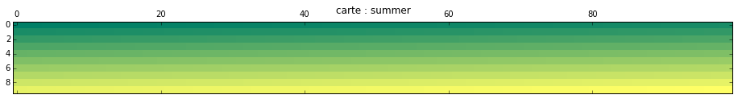

.. image:: ../../images/Matshow/output_25_2.png

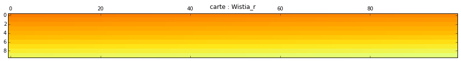

.. image:: ../../images/Matshow/output_25_4.png

.. image:: ../../images/Matshow/output_25_5.png

.. image:: ../../images/Matshow/output_25_6.png

.. image:: ../../images/Matshow/output_25_7.png

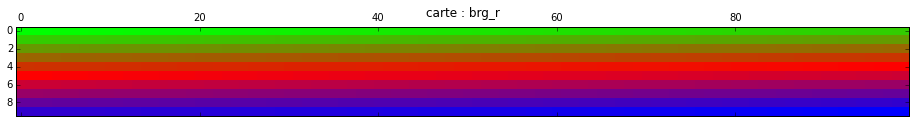

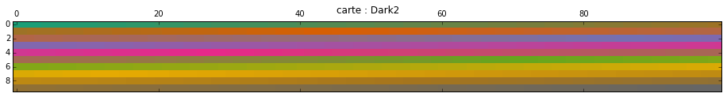

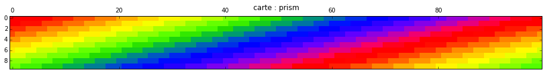

.. image:: ../../images/Matshow/output_25_11.png

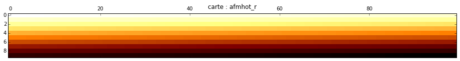

.. image:: ../../images/Matshow/output_25_13.png

.. image:: ../../images/Matshow/output_25_14.png

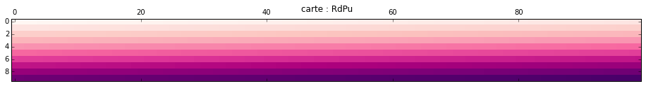

.. image:: ../../images/Matshow/output_25_16.png

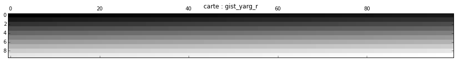

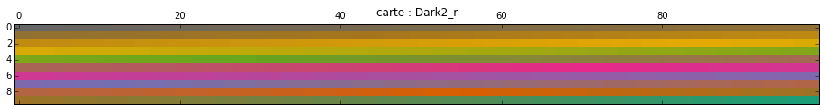

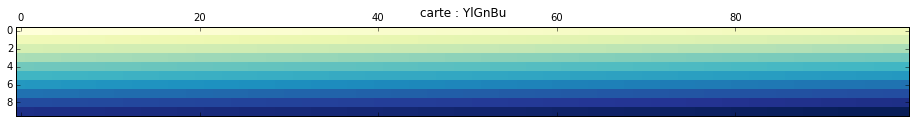

.. image:: ../../images/Matshow/output_25_20.png

.. image:: ../../images/Matshow/output_25_21.png

.. image:: ../../images/Matshow/output_25_22.png

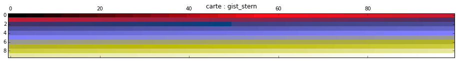

.. image:: ../../images/Matshow/output_25_24.png

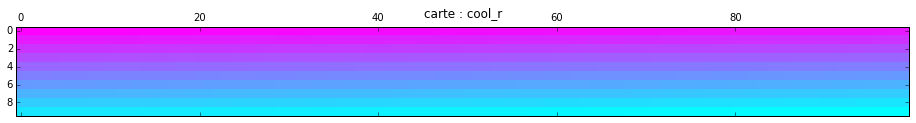

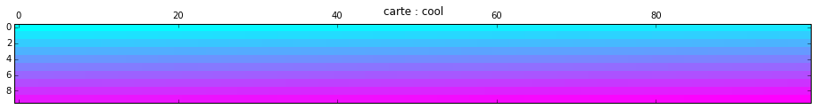

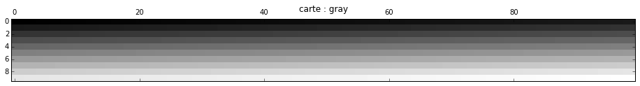

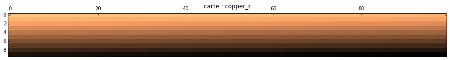

.. image:: ../../images/Matshow/output_25_29.png

.. image:: ../../images/Matshow/output_25_30.png

.. image:: ../../images/Matshow/output_25_31.png

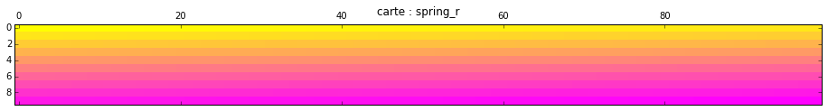

.. image:: ../../images/Matshow/output_25_33.png

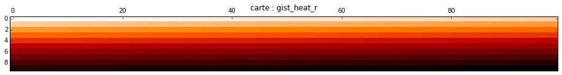

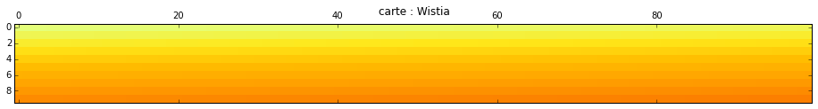

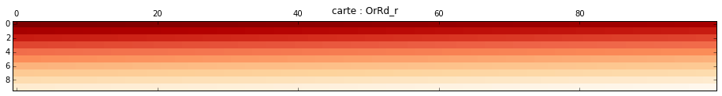

.. image:: ../../images/Matshow/output_25_37.png

.. image:: ../../images/Matshow/output_25_38.png

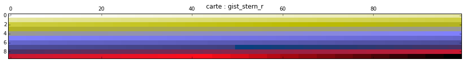

.. image:: ../../images/Matshow/output_25_40.png

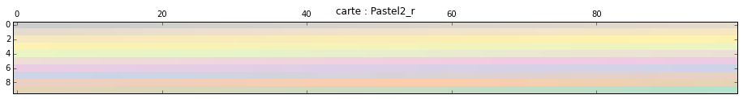

.. image:: ../../images/Matshow/output_25_42.png

.. image:: ../../images/Matshow/output_25_43.png

.. image:: ../../images/Matshow/output_25_44.png

.. image:: ../../images/Matshow/output_25_45.png

.. image:: ../../images/Matshow/output_25_46.png

.. image:: ../../images/Matshow/output_25_47.png

.. image:: ../../images/Matshow/output_25_48.png

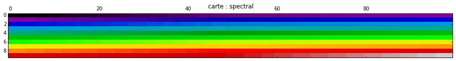

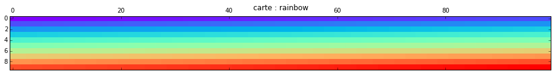

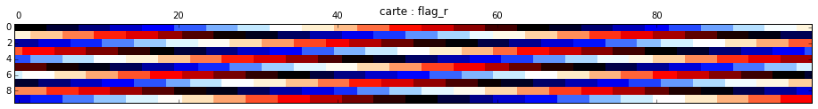

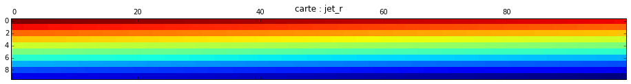

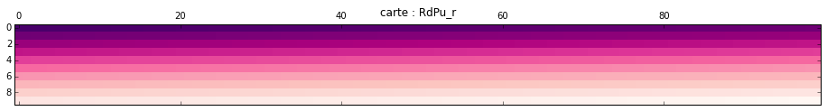

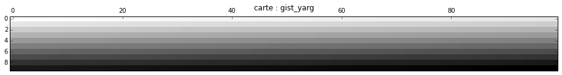

.. image:: ../../images/Matshow/output_25_55.png

.. image:: ../../images/Matshow/output_25_56.png

.. image:: ../../images/Matshow/output_25_57.png

.. image:: ../../images/Matshow/output_25_58.png

.. image:: ../../images/Matshow/output_25_59.png

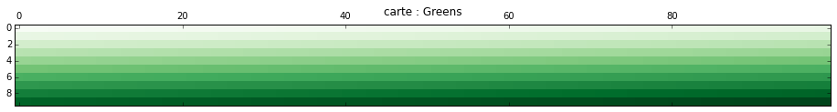

.. image:: ../../images/Matshow/output_25_61.png

.. image:: ../../images/Matshow/output_25_62.png

.. image:: ../../images/Matshow/output_25_63.png

.. image:: ../../images/Matshow/output_25_64.png

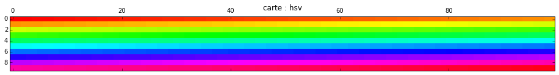

.. image:: ../../images/Matshow/output_25_66.png

.. image:: ../../images/Matshow/output_25_67.png

.. image:: ../../images/Matshow/output_25_68.png

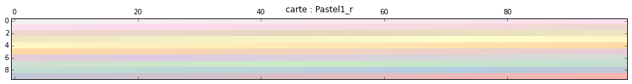

.. image:: ../../images/Matshow/output_25_70.png

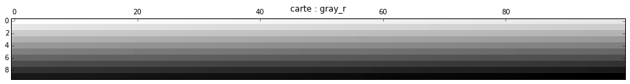

.. image:: ../../images/Matshow/output_25_72.png

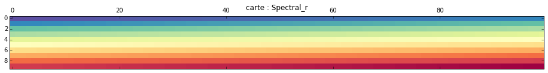

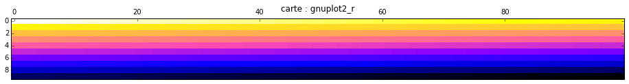

.. image:: ../../images/Matshow/output_25_75.png

.. image:: ../../images/Matshow/output_25_76.png

.. image:: ../../images/Matshow/output_25_77.png

.. image:: ../../images/Matshow/output_25_78.png

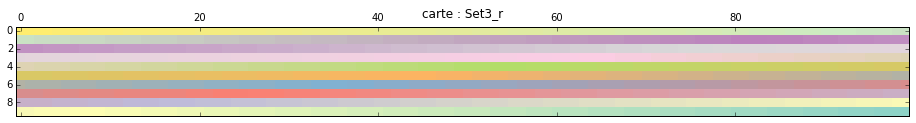

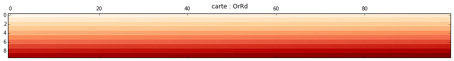

.. image:: ../../images/Matshow/output_25_81.png

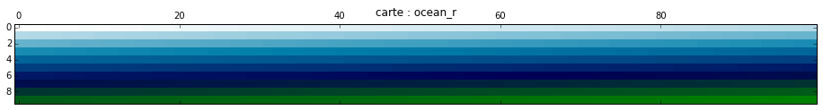

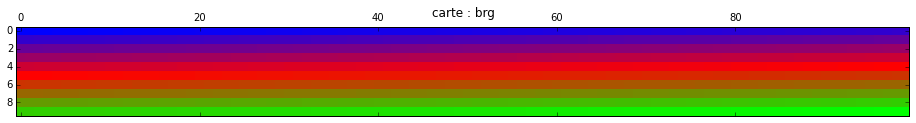

.. image:: ../../images/Matshow/output_25_84.png

.. image:: ../../images/Matshow/output_25_85.png

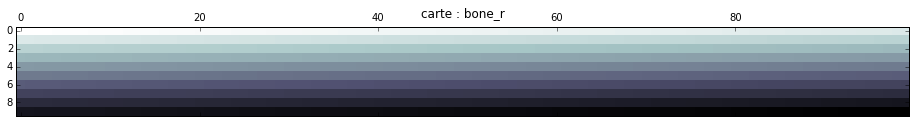

.. image:: ../../images/Matshow/output_25_87.png

.. image:: ../../images/Matshow/output_25_88.png

.. image:: ../../images/Matshow/output_25_89.png

.. image:: ../../images/Matshow/output_25_90.png

.. image:: ../../images/Matshow/output_25_91.png

.. image:: ../../images/Matshow/output_25_92.png

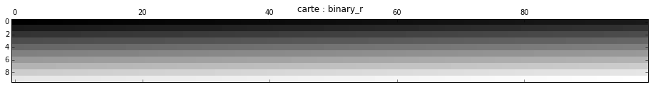

.. image:: ../../images/Matshow/output_25_94.png

.. image:: ../../images/Matshow/output_25_95.png

.. image:: ../../images/Matshow/output_25_96.png

.. image:: ../../images/Matshow/output_25_98.png

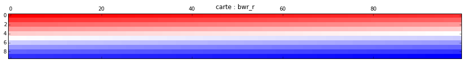

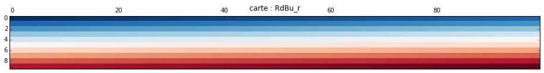

.. image:: ../../images/Matshow/output_25_101.png

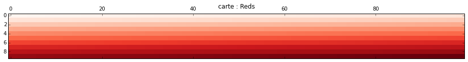

.. image:: ../../images/Matshow/output_25_103.png

.. image:: ../../images/Matshow/output_25_104.png

.. image:: ../../images/Matshow/output_25_105.png

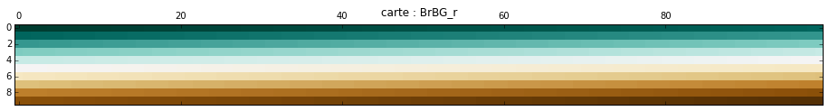

.. image:: ../../images/Matshow/output_25_107.png

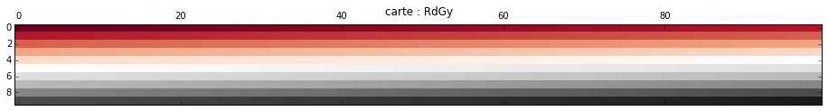

.. image:: ../../images/Matshow/output_25_109.png

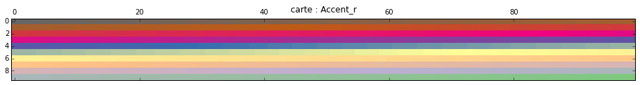

.. image:: ../../images/Matshow/output_25_111.png

.. image:: ../../images/Matshow/output_25_112.png

.. image:: ../../images/Matshow/output_25_113.png

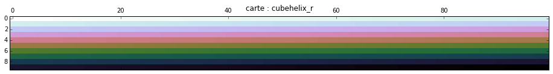

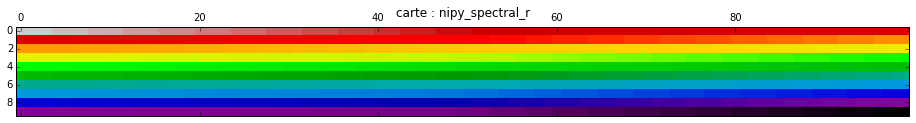

.. image:: ../../images/Matshow/output_25_116.png

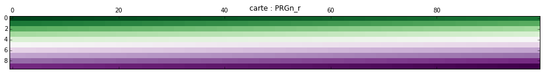

.. image:: ../../images/Matshow/output_25_118.png

.. image:: ../../images/Matshow/output_25_119.png

.. image:: ../../images/Matshow/output_25_120.png

.. image:: ../../images/Matshow/output_25_121.png

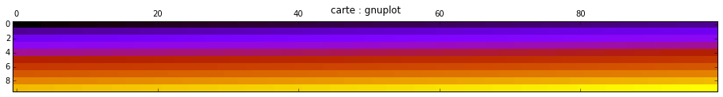

.. image:: ../../images/Matshow/output_25_123.png

.. image:: ../../images/Matshow/output_25_125.png

.. image:: ../../images/Matshow/output_25_128.png

.. image:: ../../images/Matshow/output_25_129.png

.. image:: ../../images/Matshow/output_25_132.png

.. image:: ../../images/Matshow/output_25_134.png

.. image:: ../../images/Matshow/output_25_136.png

.. image:: ../../images/Matshow/output_25_137.png

.. image:: ../../images/Matshow/output_25_138.png

.. image:: ../../images/Matshow/output_25_139.png

.. image:: ../../images/Matshow/output_25_142.png

