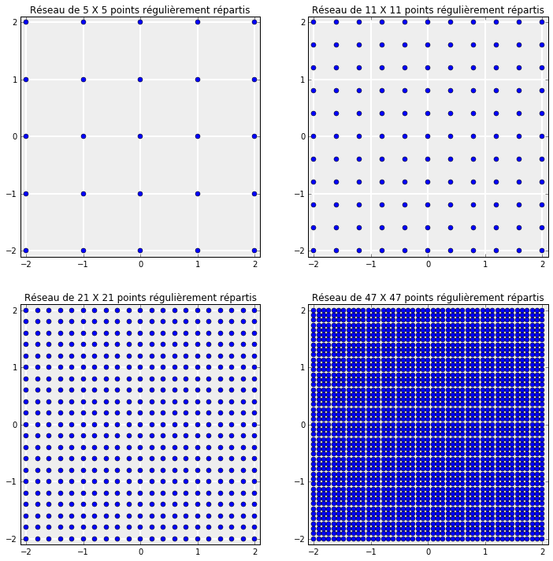
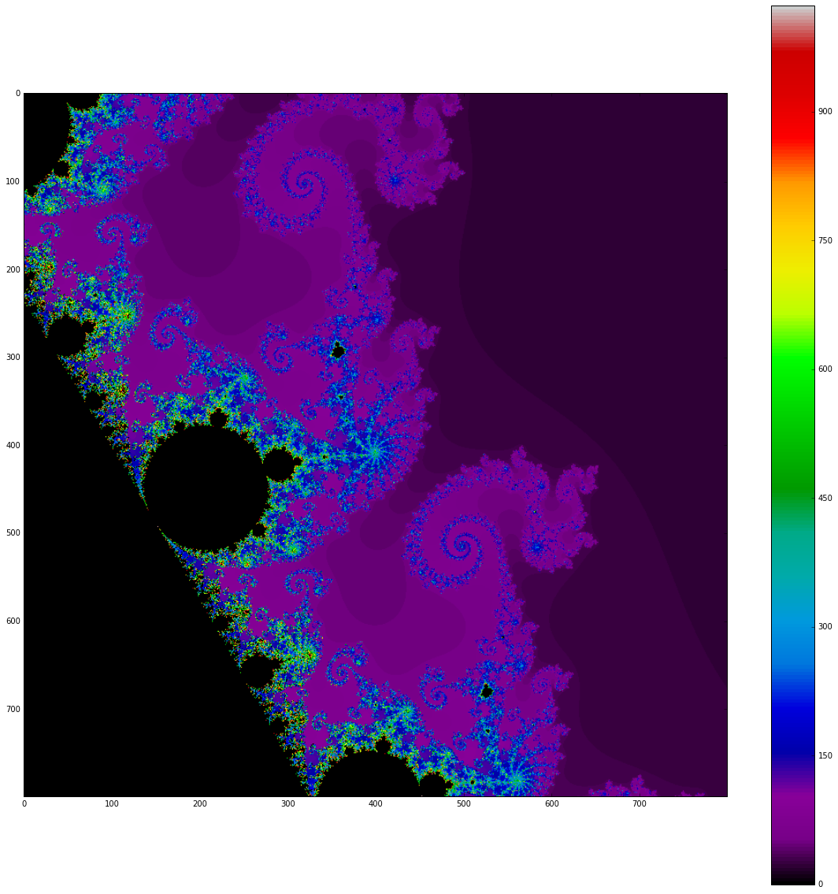
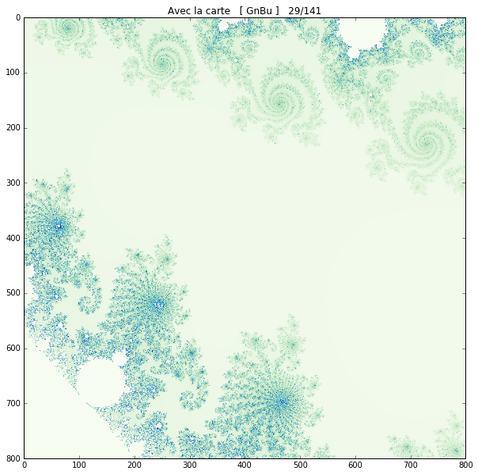
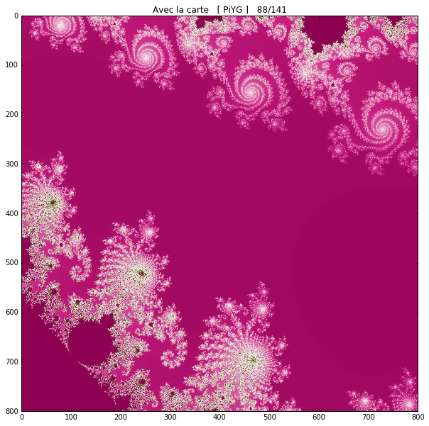
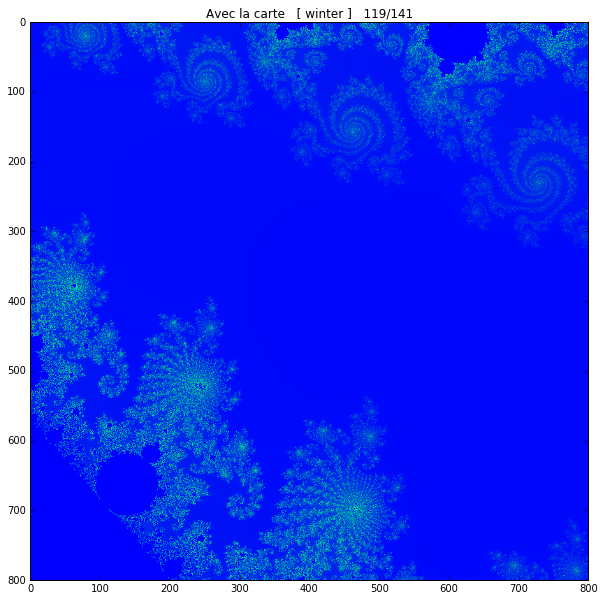

.. title: Une utilisation de numpy
.. slug: utilisation-de-numpy-ensemble-de-mandelbrot
.. date: 2016-03-11 16:25:07 UTC+01:00
.. tags: mandelbrot, fractales, numpy
.. category: 
.. link: 
.. description: 
.. type: text

.. class:: alert alert-info pull-right

.. contents::

Ensemble de Mandelbrot
----------------------

Voici ce qu'est l'ensemble de Mandelbrot. Vous pouvez l'explorer ici-même.Entre deux diapos, n'hésitez pas à vous balader sur le slide (il est interactif)  ! Je vous conseille de  passer en plein écran.

.. raw:: html

 <iframe id="iframe_container" frameborder="0" webkitallowfullscreen="" mozallowfullscreen="" allowfullscreen="" width="550" height="400" src="https://prezi.com/embed/wex-4h-h588p/?bgcolor=ffffff&amp;lock_to_path=0&amp;autoplay=0&amp;autohide_ctrls=0&amp;landing_data=bHVZZmNaNDBIWnNjdEVENDRhZDFNZGNIUE43MHdLNWpsdFJLb2ZHanI0U2g5dHRyTWVldXJ5R3F4bmNIRjZqN2RnPT0&amp;landing_sign=W7OnDqGWzDCsDksLe3aEQ2Sb9dyiiBZ8tUzp2EfOk3s"></iframe>

À la fin de ce TP, vous saurez fabriquer ces images !

.. raw:: html

 <!--TEASER_END-->

Voici les coordonnées :math:`(x_c,y_c)` du centre de chaque diapo. La largeur de l'image est de l'odre de :math:`\delta=10^{-2}` en général : 

+-----------------------+--------------+---------------+
| **Région**            | :math:`x_c=` |  :math:`y_c=` |
+-----------------------+--------------+---------------+
| Hippocampes           | -0.75        |       0.1     |
+-----------------------+--------------+---------------+
| Éléphants             |    0.275     |  0            |
+-----------------------+--------------+---------------+
| Spirales triples      | -0.088       | 0.654 	       |
+-----------------------+--------------+---------------+
| Spirales quadruples   | 0.274        | 0.482         |
+-----------------------+--------------+---------------+		
| Sceptres              |   -1.36      | 0.005         |
+-----------------------+--------------+---------------+
| Doubles sceptres      |   -0.1002    | 0.8383        |
+-----------------------+--------------+---------------+
| Sceptres (variante)   | -1.108       |   0.230       |
+-----------------------+--------------+---------------+
| Mini Mandelbrot       | -1.75        |   0           |
+-----------------------+--------------+---------------+	
| Autre mini Mandelbrot |  -0.1592     |   -1.0317     |
+-----------------------+--------------+---------------+

Le point de départ
------------------

Soit :math:`z_0` un complexe donné et soit la suite donnée par son
premier terme égal à :math:`z_0` et :

.. math::  \forall n \ge 0 \quad z_{n+1}= z_n^2 + z_0

1. Construire une fonction **liste\_suite(z0,n)** qui prend un complexe
   :math:`z_0` et un entier :math:`n` et retourne en sortie la *liste*
   :math:`\mathtt{[z_0, z_1,  \dots, z_n]}`.

2. Donner les listes **liste\_suite(z0,10)** pour
   :math:`z_0\in\left\{0,\quad 1,\quad-1,\quad i,\quad -i,\quad \dfrac{1+i}{2}\right\}`.

Réponse à la question 1 :

.. code:: python

    def liste_suite(z0,n):
        """
        z0 : premier terme de la suite. On l'appelle le germe
        sortie : liste [z0,..zn]. Cette liste s'appelle " les
        n premiers pas de la trajectoire du germe z0"
        """
        u = z0 
        L = [z0]
        for k in range(n): # c'est la même chose que range(0,n)
            u = u**2 + z0
            L.append(u)
        return L

Pour la question 2, une boucle serait la bienvenue ! Voici :

.. code:: python

    valeurs_initiales=[0,  1,  -1,   1j,   -1j,   0.5+0.5j]
    for z0 in valeurs_initiales:
         print(liste_suite(z0,5))

.. parsed-literal::

    [0, 0, 0, 0, 0, 0]
    [1, 2, 5, 26, 677, 458330]
    [-1, 0, -1, 0, -1, 0]
    [1j, (-1+1j), -1j, (-1+1j), -1j, (-1+1j)]
    [-1j, (-1-1j), 1j, (-1-1j), 1j, (-1-1j)]
    [(0.5+0.5j), (0.5+1j), (-0.25+1.5j), (-1.6875-0.25j), (3.28515625+1.34375j), (9.486587524414062+9.328857421875j)]

Les comportements sont assez variables suivant la valeur de :math:`z_0`
choisi. On aimerait bien classer les :math:`z_0` suivant le comportement
de la suite qu'ils initialise. Pour cela :

Je cherche le premier indice :math:`n` de la suite tel que :

.. math:: n \le 256 

.. math::  |z_n| >2

Cet entier s'appelle la durée de vie de :math:`z_0`. Si cet entier
n'existe pas, on le pose par convention égal à 0.

**Exercice**. Construire la fonction **duree\_de\_vie(z0)** qui calcule
la durée de vie d'un complexe :math:`z0`.

**Indication.** Comme on sait qu'on calcule **au plus** 256 termes
de la suite, on implémente une boucle **for** avec *interruption de
boucle* au lieu d'une boucle **while**.

.. code:: python

    def duree_de_vie(z0):
        """
        *** Entrée : ***  z0 : un complexe
        On consdidère alors la suite (zn) définie par :
                  z_[n+1] = z_n² + z0
                  
        *** Sortie : ***  la durée de vie de z0, c-à-d :
        le premier rang  k < 257 tel que |zk| > 2,
        si ce rang k existe. Sinon la fonction retourne 0.
        """
        u = z0
        duree = 0             # duree est en fait l'indice du terme courant.
        for j in range(256):  # range(r) signifie :  range(0,r).
            u = u**2+z0       # je passe au terme suivant de la suite.
            duree += 1        # j'incrémente l'indice du coup.
            if abs(u)>2:      # c'est le module de z_n, que je compare à 2.
                return duree  # Python arrête l'exécution de la fonction 
                              # dès qu'il exécute un return.
        return 0              # Si le if n'est jamais vérifié : k n'existe pas.

Par exemple pour :math:`z_0 = \frac{1+i}{2}` :

.. code:: python

    duree_de_vie(0.5+0.5j)

.. parsed-literal::

    4

Vérifions :

.. code:: python

    L = liste_suite(0.5+0.5j,10) # liste des 11 premiers termes de la suite
    
    print('module de z3= {} et module de z4= {}').format(abs(L[3]),abs(L[4])) # modules de z3 et z4

.. parsed-literal::

    module de z3= 1.70591800799 et module de z4= 3.54935425809

On voit bien que la durée de vie de :math:`z_0` est égale à 4.

Systématiser le calcul et fabriquer l'image
-------------------------------------------

On va colorier les points du plan du complexe en assignant à chaque
durée de vie une couleur. Comme tout se joue dans le disque de rayon 2,
je vais considérer les points du plan complexe dont les parties rélle et
imaginaire sont comprises entre :math:`-2` et :math:`2` :

.. math::  R =  \{ x+iy \quad -2 \le x \le 2,  \quad -2\le y \le 2 \}.

L'ensemble :math:`R` est donc un carré.

Pourquoi cet ensemble ? Parce qu'on montre facilement que si un terme de
la suite :math:`(z_n)` dépasse 2 en module, alors c'est le cas de tous
les suivants. Donc, si :math:`|z_0|>2`, la durée de ce germe ne nous
intéresse pas.

Comme l'ensemble :math:`R` contient une infinité de points, je ne peux
pas calculer la durée de vie de tous les points qu'il contient. Il faut
donc que j'en sélectionne suffisamment pour avoir une image précise.
Pour cela, je réalise un **maillage** de :math:`R` : je sélectionne un
réseau de points réguliérement répartis dans :math:`R`.

Mettons un réseau de :math:`p \times p = p^2` ponts répartis
symétriquement dans le carré :math:`R`.

Voici à quoi ressemblent ces réseaux au fur et à mesure que le nombre de
points choisis augmente :

.. code:: python

    import numpy as np # importation prudente
    import matplotlib.pyplot as plt 
    %matplotlib inline
    
    def image_reseau(liste):
        """ 
        liste : liste de 4 entiers :  liste = [p_1, .. p_4]
        sortie : une famille de 4 images :  
        la k-ème image est le réseau de points de R construit
        à partir de p_k points répartis symétriquement sur l'axe
        des abscisses autour de 0.
        """
        fig = plt.figure(figsize=(12,12)) # Taille de l'image
        for k in range(4):
            p = liste[k]
            ax = fig.add_subplot(221+k, axisbg='#EEEEEE',axisbelow=True) # je change la couleur du fond
                                                                                  # Je mets la grille en arrière-plan  
            ax.grid(color='w', linewidth=2, linestyle='solid')                    # ma grille est en blanc, traits forts
            ax.set_xlim(-2.1,2.1)
            ax.set_ylim(-2.1,2.1)
            X = np.linspace(-2,2,p)
            Y = np.linspace(-2,2,p)
            Lx = [k for k in X for j in range(p)]
            Ly = list(Y)*p
            plt.plot(Lx,Ly,'o')
            plt.title(u'Réseau de {} X {} points régulièrement répartis'.format(p,p))
    
    image_reseau([5,11,21,47])

On voit bien que si on prend beaucoup de points sur le réseau, et en
coloriant ces points suivant leur durée de vie, on obtiendra une belle
mosaïque colorée de l'ensemble :math:`R`.

Utiliser les possiblités de ``numpy``
-------------------------------------

Par exemple, pour le réseau de :math:`5 \times 5` points dessinés
ci-dessus, la matrice contenant les affixes des points de ce réseau est
:

.. math::

   \begin{pmatrix}
    -2 + 2i & -1 + 2i &  2i &  1+ 2i & 2+ 2i \\
    -2 + i & -1 + i &  i &  1+ i & 2+ i \\
    -2  & -1  &  0 & 1 & 2 \\
    -2 -i & -1-i  &  -i &  1-i & 2-i \\
    -2 - 2i & -1 - 2i & -2i &  1-2i & 2- 2i \\
    \end{pmatrix}
    

**Question.** Recopiez les instructions suivantes permettant de
construire la matrice contenant les affixes des points du réseau :

.. code:: python

    def reseau(nb_points):
        # construction des abscisses
        #---------------------------
        x = np.linspace(-2,2,nb_points) # nb_points regulièrement
                                        # répartis de (-2) à 2
        # Construction des ordonnées
        #---------------------------
        y = np.linspace(2,-2,nb_points) # Attention les ordonnées vont décroissant
        
        X,Y = np.meshgrid(x,y) # J'ai maillé mon domaine
                               # meshgrid retrourne deux matrices
        # Rem : on pourrait se passer de meshgrid et calculer X et Y
        # par un produit matriciel avec des matrices de 1.
        
        return X+1j*Y

On vérifie que la fonction :math:`\texttt{reseau}` fait bien ce que l'on
voulait :

.. code:: python

    Z0 = reseau(5)
    print Z0

.. parsed-literal::

    [[-2.+2.j -1.+2.j  0.+2.j  1.+2.j  2.+2.j]
     [-2.+1.j -1.+1.j  0.+1.j  1.+1.j  2.+1.j]
     [-2.+0.j -1.+0.j  0.+0.j  1.+0.j  2.+0.j]
     [-2.-1.j -1.-1.j  0.-1.j  1.-1.j  2.-1.j]
     [-2.-2.j -1.-2.j  0.-2.j  1.-2.j  2.-2.j]]

**Question.** Pour les 25 germes donnés par cette matrice, (c'est-à-dire
pour les 25 valeurs de :math:`z_0` données par ce tableau), calculer les
25 listes de termes :math:`[z_0,z_1,z_2,z_3]` correspondantes. Pensez à
utiliser votre fonction ``liste_suite`` pour aller plus vite, et faites
une boucle.

.. code:: python

    for i in range(5):
        for j in range(5):
            z0 = Z0[i,j] 
            print liste_suite(z0,3)

.. parsed-literal::

    [(-2+2j), (-2-6j), (-34+26j), (478-1766j)]
    [(-1+2j), (-4-2j), (11+18j), (-204+398j)]
    [2j, (-4+2j), (12-14j), (-52-334j)]
    [(1+2j), (-2+6j), (-31-22j), (478+1366j)]
    [(2+2j), (2+10j), (-94+42j), (7074-7894j)]
    [(-2+1j), (1-3j), (-10-5j), (73+101j)]
    [(-1+1j), (-1-1j), (-1+3j), (-9-5j)]
    [1j, (-1+1j), -1j, (-1+1j)]
    [(1+1j), (1+3j), (-7+7j), (1-97j)]
    [(2+1j), (5+5j), (2+51j), (-2595+205j)]
    [(-2+0j), (2+0j), (2+0j), (2+0j)]
    [(-1+0j), 0j, (-1+0j), 0j]
    [0j, 0j, 0j, 0j]
    [(1+0j), (2+0j), (5+0j), (26+0j)]
    [(2+0j), (6+0j), (38+0j), (1446+0j)]
    [(-2-1j), (1+3j), (-10+5j), (73-101j)]
    [(-1-1j), (-1+1j), (-1-3j), (-9+5j)]
    [-1j, (-1-1j), 1j, (-1-1j)]
    [(1-1j), (1-3j), (-7-7j), (1+97j)]
    [(2-1j), (5-5j), (2-51j), (-2595-205j)]
    [(-2-2j), (-2+6j), (-34-26j), (478+1766j)]
    [(-1-2j), (-4+2j), (11-18j), (-204-398j)]
    [-2j, (-4-2j), (12+14j), (-52+334j)]
    [(1-2j), (-2-6j), (-31+22j), (478-1366j)]
    [(2-2j), (2-10j), (-94-42j), (7074+7894j)]

**Question.** Comment interpréter les coefficient de ``Z`` à l'issue des
instructions suivantes en termes de suites :math:`(z_n)` ?

.. code:: python

    nb = 5 # réseau de  5 X 5 points
    Z0  = reseau(nb)
    Z = np.copy(Z0) # je fais une copie de Z0 indépendante de Z0
    Z = Z*Z + Z0    # Rappel : ce n'est pas le produit matriciel 
    
    print Z

.. parsed-literal::

    [[-2. -6.j -4. -2.j -4. +2.j -2. +6.j  2.+10.j]
     [ 1. -3.j -1. -1.j -1. +1.j  1. +3.j  5. +5.j]
     [ 2. +0.j  0. +0.j  0. +0.j  2. +0.j  6. +0.j]
     [ 1. +3.j -1. +1.j -1. -1.j  1. -3.j  5. -5.j]
     [-2. +6.j -4. +2.j -4. -2.j -2. -6.j  2.-10.j]]

On a compris que l'itération de la commande ``Z = Z*Z + Z0`` donne les
termes consécutifs des suites :math:`(z_n)` initialisées par chacun des
germes contenus dans ``Z0``.

Des Nan
-------

**Question.** La constante ``nan`` (pour ``not a number``) a des
propriétés intéressantes pour le calcul numérique. Vous pouvez la penser
comme valant :math:`\infty` (infini sans signe : en gros (mais alors,
vraiment en gros !), tout ce qui donnerait une forme indéterminée).

.. code:: python

    from numpy import nan

Demandez à ``Python`` ce que donnent les calculs suivants :

.. code:: python

    nan + nan

.. parsed-literal::

    nan

.. code:: python

    nan - nan

.. parsed-literal::

    nan

.. code:: python

    nan * nan

.. parsed-literal::

    nan

.. code:: python

    nan * nan - nan

.. parsed-literal::

    nan

.. code:: python

    1/nan

.. parsed-literal::

    nan

Tracé de l'image
----------------

Le script
=========

L'idée est simple ensuite : on part d'une matrice de la même taille que
celle du réseau choisi, mais en place de chaque germe, on inscrit sa
durée de vie. La matrice ainsi fabriquée nous donnera la mosaïque de
couleurs recherchée :

.. code:: python

    def trace_image(nb):
        """ **entrée** : <nb>, un entier qui détermine le nombre de points 
             du réseau maillant le carré [-2,2] X [-2,2]: il contient donc
             nb*nb points. En quelque sorte, nb fixe la résolution de l'image.
            
            ** sortie** : <image>, une matrice de même taille que le réseau,
            qui contient en en position (i,j) la  durée du vie du germe 
            placé en position (i,j) dans la matrice définissant le réseau.
            
            La fonction, en plus de calculer cette <image>, réalise son 
            affichage par la commande matshow.
        """
        
        #1. INITIALISATION DES DONNÉES
        #-----------------------------
        
        Z0 = reseau(nb)         # j'initialise la matrice du réseau de germes
                                # Z0 est une matrice de taille nb X nb.
        
        image = np.zeros((nb,nb)) # Au début, tous les pixels sont noirs.
                                  # la matrice image contient les couleurs 
                                  # de chaque germe(c-à-d les durées de vie).
                
        Z = np.copy(Z0)         # Z est un clone de Z0 : destiné à contenir Z1, 
                                # puis Z2, etc. (ainsi on ne modifie pas Z0).
        
        #2. BOUCLE POUR LE COLORIAGE DE LA MATRICE image
        #-----------------------------------------------
        
        
        for k in range(257):    # on regarde les 256 premiers termes 
                                # des trajectoires de chaque germe.
            
            Z= Z*Z + Z0         # Calcul simultané de tous les zk (merci numpy).
            
            for i in range(nb):  # j'examine un par un les coeffs Z[i,j] de Z. 
                for j in range(nb):
                    zk = Z[i,j]     # je prends le coeff.  zk en position i,j.
                    if abs(zk)>2:   # je regarde si son module dépasse 2. 
                                                     
                        
                        image[i,j] = k  # Dans ce cas, sa durée de vie est bien k.
                        
                        Z[i,j]=nan      # Puis je l'oublie dans Z en lui
                                        # assignant la valeur nan, car abs(nan)
                                        # est toujours faux.
        
        
        #3. AFFICHAGE DE LA MATRICE image
        #--------------------------------
        
        plt.figure(figsize=(20,20))          # je définis la taille de l'image
        plt.imshow(image, cmap = 'spectral') # j'affiche l'image : c-à-d 
                                             # la mosaïque des couleurs
        plt.colorbar()                       # et la barre des couleurs : elle donne
                                             # la correspondace couleurs <-> coeffs
        return image

Il ne reste plus qu'à essayer :

.. code:: python

    # Essai pour une petite résolution : 80 X 80
    mandel = trace_image(300)

.. image:: ../../images/TP-Mandel/output_36_0.png

Une amélioration : spécifier quelle région de l'ensemble observer
=================================================================

Il suffit juste d'ajouter des paramètres ``xc``,\ ``yc``,\ ``delta`` à
la fonction ``reseau`` pour obteir un maillage du carré centre en
:math:`(x_c,y_c)` et de côté :math:`2\delta` :

.. code:: python

    def reseau2(nb_points, xc,yc,delta):
        """ comme la fonction réseau, mais on regarde non 
            plus le carré [-2,2] X [-2,2], mais le
            carré centré en (xc,yc) et de longueur 2delta 
        """
        x = np.linspace(xc-delta,xc+delta,nb_points) 
        y = np.linspace(yc+delta,yc-delta,nb_points) 
        X,Y = np.meshgrid(x,y) 
        
        return X+1j*Y

Du coup, je dois aussi modifier la fonction
:math:`\texttt{trace}\_\texttt{image}` puisqu'elle faisait appel à
:math:`\texttt{reseau}`.

Et en extra, tant qu'à faire, j'introduis de quoi rendre le calcul plus
rapide. Comparez avec la fonction
:math:`\texttt{trace}\_\texttt{image}`, on s'affranchit au maximum des
boucles qui sont gloutonnes en temps d'exécution :

.. code:: python

    def trace_image2(nb,xc,yc,delta):
        """ Même chose que trace image,
           mais on peut sélectionner le
           carré à colorier.      
        """
        
        Z0 = reseau2(nb,xc,yc,delta)       
        image = np.zeros((nb,nb))  
        Z = np.copy(Z0)         
        
        for k in xrange(1025):       # xrange : du range optimisé  
            Z= Z*Z + Z0        
            J = np.where(abs(Z)>2)  # me dit quels coeffs sont  >2 en module      
            image[J] = k            # je mets  à jour image
            Z[J]= nan               # je mets de nan au bon endroit
        
        plt.figure(figsize=(20,20))                   
        plt.imshow(image, cmap = 'spectral')          
        plt.colorbar()                                
                                                     
        return image

.. code:: python

    np.seterr(invalid='ignore') # on atteint vite des grands nombres, je mets en silence 
                                # les avertissements de Python
    mandel2= trace_image2(800,0,0,2) # J'ai pris une matrice 800 X 800

Des propositions d'exploration
==============================

.. code:: python

    xc = -0.77716
    yc = 0.12712
    delta = 1e-2
    
    monImage = trace_image2(800,xc,yc,delta)

.. code:: python

    xc = -0.74836
    yc = -0.09513
    delta = 1e-2
    
    mandel = trace_image2(800,xc,yc,delta)

.. code:: python

    xc = -0.7473303
    yc = -0.1003063
    delta = 1e-3
    
    mandel = trace_image2(800,xc,yc,delta)

.. image:: ../../images/TP-Mandel/output_47_0.png

.. code:: python

    xc = 0.274
    yc = 0.482
    delta = 5e-3
    np.seterr(invalid='ignore')
    mandel = trace_image2(800,xc,yc,delta)

.. code:: python

    cartes=['summer', 'coolwarm', 'pink_r', 'Set1', 'Set2', 'Set3', 'brg_r', 'Dark2', 'prism', 'PuOr_r', 'afmhot_r', 'terrain_r', 'PuBuGn_r', 'RdPu', 'gist_ncar_r', 'gist_yarg_r', 'Dark2_r', 'YlGnBu', 'RdYlBu', 'hot_r', 'gist_rainbow_r', 'gist_stern', 'PuBu_r', 'cool_r', 'cool', 'gray', 'copper_r', 'Greens_r', 'GnBu', 'gist_ncar', 'spring_r', 'gist_rainbow', 'gist_heat_r', 'OrRd_r', 'CMRmap', 'bone', 'gist_stern_r', 'RdYlGn', 'Pastel2_r', 'spring', 'terrain', 'YlOrRd_r', 'Set2_r', 'winter_r', 'PuBu', 'RdGy_r', 'spectral', 'rainbow', 'flag_r', 'jet_r', 'RdPu_r', 'gist_yarg', 'BuGn', 'Paired_r', 'hsv_r', 'bwr', 'cubehelix', 'Greens', 'PRGn', 'gist_heat', 'spectral_r', 'Paired', 'hsv', 'Oranges_r', 'prism_r', 'Pastel2', 'Pastel1_r', 'Pastel1', 'gray_r', 'jet', 'Spectral_r', 'gnuplot2_r', 'gist_earth', 'YlGnBu_r', 'copper', 'gist_earth_r', 'Set3_r', 'OrRd', 'gnuplot_r', 'ocean_r', 'brg', 'gnuplot2', 'PuRd_r', 'bone_r', 'BuPu', 'Oranges', 'RdYlGn_r', 'PiYG', 'CMRmap_r', 'YlGn', 'binary_r', 'gist_gray_r', 'Accent', 'BuPu_r', 'gist_gray', 'flag', 'bwr_r', 'RdBu_r', 'BrBG', 'Reds', 'Set1_r', 'summer_r', 'GnBu_r', 'BrBG_r', 'Reds_r', 'RdGy', 'PuRd', 'Accent_r', 'Blues', 'autumn_r', 'autumn', 'cubehelix_r', 'nipy_spectral_r', 'ocean', 'PRGn_r', 'Greys_r', 'pink', 'binary', 'winter', 'gnuplot', 'RdYlBu_r', 'hot', 'YlOrBr', 'coolwarm_r', 'rainbow_r', 'Purples_r', 'PiYG_r', 'YlGn_r', 'Blues_r', 'YlOrBr_r', 'seismic', 'Purples', 'seismic_r', 'RdBu', 'Greys', 'BuGn_r', 'YlOrRd', 'PuOr', 'PuBuGn', 'nipy_spectral', 'afmhot']

.. code:: python

    total = len(cartes)
    i=0
    for carte in cartes:
        i+=1
        plt.figure(figsize=(10,10))
        plt.title('Avec la carte   [ {} ]   {}/{}'.format(carte,i,total))
        plt.imshow(mandel, cmap =carte)

.. image:: ../../images/TP-Mandel/output_51_1.png

.. image:: ../../images/TP-Mandel/output_51_2.png

.. image:: ../../images/TP-Mandel/output_51_4.png

.. image:: ../../images/TP-Mandel/output_51_6.png

.. image:: ../../images/TP-Mandel/output_51_7.png

.. image:: ../../images/TP-Mandel/output_51_8.png

.. image:: ../../images/TP-Mandel/output_51_15.png

.. image:: ../../images/TP-Mandel/output_51_16.png

.. image:: ../../images/TP-Mandel/output_51_20.png

.. image:: ../../images/TP-Mandel/output_51_21.png

.. image:: ../../images/TP-Mandel/output_51_24.png

.. image:: ../../images/TP-Mandel/output_51_26.png

.. image:: ../../images/TP-Mandel/output_51_28.png

.. image:: ../../images/TP-Mandel/output_51_30.png

.. image:: ../../images/TP-Mandel/output_51_31.png

.. image:: ../../images/TP-Mandel/output_51_32.png

.. image:: ../../images/TP-Mandel/output_51_33.png

.. image:: ../../images/TP-Mandel/output_51_34.png

.. image:: ../../images/TP-Mandel/output_51_36.png

.. image:: ../../images/TP-Mandel/output_51_37.png

.. image:: ../../images/TP-Mandel/output_51_38.png

.. image:: ../../images/TP-Mandel/output_51_39.png

.. image:: ../../images/TP-Mandel/output_51_40.png

.. image:: ../../images/TP-Mandel/output_51_41.png

.. image:: ../../images/TP-Mandel/output_51_42.png

.. image:: ../../images/TP-Mandel/output_51_43.png

.. image:: ../../images/TP-Mandel/output_51_44.png

.. image:: ../../images/TP-Mandel/output_51_46.png

.. image:: ../../images/TP-Mandel/output_51_48.png

.. image:: ../../images/TP-Mandel/output_51_50.png

.. image:: ../../images/TP-Mandel/output_51_54.png

.. image:: ../../images/TP-Mandel/output_51_57.png

.. image:: ../../images/TP-Mandel/output_51_59.png

.. image:: ../../images/TP-Mandel/output_51_60.png

.. image:: ../../images/TP-Mandel/output_51_63.png

.. image:: ../../images/TP-Mandel/output_51_64.png

.. image:: ../../images/TP-Mandel/output_51_66.png

.. image:: ../../images/TP-Mandel/output_51_68.png

.. image:: ../../images/TP-Mandel/output_51_71.png

.. image:: ../../images/TP-Mandel/output_51_72.png

.. image:: ../../images/TP-Mandel/output_51_74.png

.. image:: ../../images/TP-Mandel/output_51_75.png

.. image:: ../../images/TP-Mandel/output_51_76.png

.. image:: ../../images/TP-Mandel/output_51_77.png

.. image:: ../../images/TP-Mandel/output_51_78.png

.. image:: ../../images/TP-Mandel/output_51_79.png

.. image:: ../../images/TP-Mandel/output_51_84.png

.. image:: ../../images/TP-Mandel/output_51_86.png

.. image:: ../../images/TP-Mandel/output_51_90.png

.. image:: ../../images/TP-Mandel/output_51_95.png

.. image:: ../../images/TP-Mandel/output_51_96.png

.. image:: ../../images/TP-Mandel/output_51_97.png

.. image:: ../../images/TP-Mandel/output_51_104.png

.. image:: ../../images/TP-Mandel/output_51_106.png

.. image:: ../../images/TP-Mandel/output_51_108.png

.. image:: ../../images/TP-Mandel/output_51_110.png

.. image:: ../../images/TP-Mandel/output_51_111.png

.. image:: ../../images/TP-Mandel/output_51_113.png

.. image:: ../../images/TP-Mandel/output_51_114.png

.. image:: ../../images/TP-Mandel/output_51_116.png

.. image:: ../../images/TP-Mandel/output_51_118.png

.. image:: ../../images/TP-Mandel/output_51_122.png

.. image:: ../../images/TP-Mandel/output_51_123.png

.. image:: ../../images/TP-Mandel/output_51_126.png

.. image:: ../../images/TP-Mandel/output_51_129.png

.. image:: ../../images/TP-Mandel/output_51_130.png

.. image:: ../../images/TP-Mandel/output_51_136.png

.. image:: ../../images/TP-Mandel/output_51_138.png

.. image:: ../../images/TP-Mandel/output_51_140.png

.. image:: ../../images/TP-Mandel/output_51_141.png

